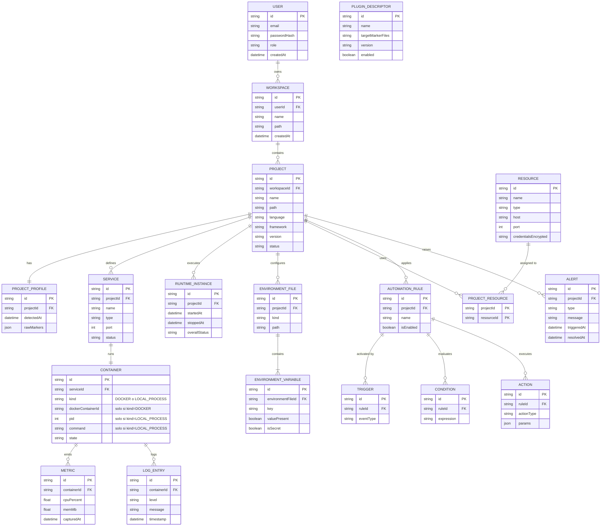

# DevVault — Análisis y Diseño del Sistema

## 1. Visión del producto

DevVault es una plataforma local que descubre, entiende y administra los ecosistemas de desarrollo de un desarrollador: no solo código, sino los servicios, variables de entorno, contenedores y automatizaciones que rodean a cada proyecto.

**Problema que resuelve:** cuando trabajas en varios proyectos, cada uno con su propio stack (Spring Boot, React, Postgres, Redis, Docker...), pierdes tiempo recordando cómo levantar cada uno, qué variables de entorno le faltan, o si un contenedor se cayó. DevVault centraliza eso.

**Usuario objetivo (v1):** tú mismo, un desarrollador que trabaja con múltiples proyectos locales. No hay multiusuario real en el MVP — la capa de Identity existe para dejar la puerta abierta a una versión colaborativa futura.

---

## 2. Requisitos funcionales

Agrupados por bounded context, con prioridad (M = MVP 0.1, S = 0.2, L = 0.3+).

### 2.1 Identity
| ID | Requisito | Prioridad |
|---|---|---|
| RF-01 | El sistema permite login local con usuario/contraseña | M |
| RF-02 | El sistema emite un JWT válido por sesión | M |
| RF-03 | El sistema soporta roles (ADMIN, USER) para preparar multiusuario futuro | S |

### 2.2 Workspace Management
| ID | Requisito | Prioridad |
|---|---|---|
| RF-04 | El usuario puede crear un Workspace apuntando a una ruta local (ej. `D:/Development`) | M |
| RF-05 | El usuario puede tener varios Workspaces | M |
| RF-06 | El sistema puede re-escanear un Workspace bajo demanda | M |

### 2.3 Project Discovery (Scanner Engine)
| ID | Requisito | Prioridad |
|---|---|---|
| RF-07 | El sistema recorre recursivamente las carpetas de un Workspace | M |
| RF-08 | El sistema detecta tecnología por archivos marcador (`pom.xml`, `package.json`, `composer.json`, etc.) | M |
| RF-09 | El sistema genera un Project Profile (lenguaje, framework, versión) por cada proyecto encontrado | M |
| RF-10 | El sistema permite extender la detección vía plugins sin tocar el núcleo | L |

### 2.4 Runtime Management
| ID | Requisito | Prioridad |
|---|---|---|
| RF-11 | El sistema detecta si un proyecto tiene `docker-compose.yml` | M |
| RF-12 | El usuario puede iniciar/detener/reiniciar un proyecto con un clic | S |
| RF-13 | El sistema reporta el estado de cada servicio (RUNNING, STOPPED, FAILED) | S |
| RF-14 | El sistema hace health check tras levantar los contenedores | S |

### 2.5 Resource Management
| ID | Requisito | Prioridad |
|---|---|---|
| RF-15 | El usuario puede registrar recursos compartidos (Postgres local, Redis, RabbitMQ) | S |
| RF-16 | Un recurso puede estar asociado a varios proyectos | S |

### 2.6 Environment Management
| ID | Requisito | Prioridad |
|---|---|---|
| RF-17 | El sistema lee y muestra variables de entorno (`.env`, `application.yml`) por proyecto | S |
| RF-18 | El sistema compara variables entre ambientes (dev vs prod) y marca faltantes | L |

### 2.7 Automation Engine
| ID | Requisito | Prioridad |
|---|---|---|
| RF-19 | El usuario puede definir reglas `trigger → condición → acción` | L |
| RF-20 | El sistema ejecuta acciones automáticas ante eventos (proyecto iniciado, contenedor caído) | L |

### 2.8 Monitoring
| ID | Requisito | Prioridad |
|---|---|---|
| RF-21 | El sistema muestra CPU/RAM de runtimes Docker y procesos locales; para procesos locales agrega el árbol de procesos del PID raíz usando OSHI | S |
| RF-22 | El sistema hace streaming de logs en vivo por servicio | S |
| RF-23 | El sistema genera alertas cuando falla un runtime Docker o un proceso local | L |

### 2.9 Plugin System
| ID | Requisito | Prioridad |
|---|---|---|
| RF-24 | El núcleo expone una interfaz `TechnologyPlugin` para agregar detección de nuevos stacks | L |

---

## 3. Requisitos no funcionales

| ID | Requisito |
|---|---|
| RNF-01 | Todo el sistema corre 100% local, sin dependencias de servicios pagos |
| RNF-02 | El escaneo de un Workspace con ~50 proyectos debe completarse en menos de 10s |
| RNF-03 | La arquitectura debe permitir extraer un módulo a microservicio sin reescribir su lógica de negocio (bajo acoplamiento entre bounded contexts) |
| RNF-04 | El acceso a la API de Docker no debe bloquear el hilo principal de la aplicación (operaciones asíncronas) |
| RNF-05 | Las credenciales de recursos (Resource Management) se almacenan cifradas, nunca en texto plano |
| RNF-06 | El sistema debe seguir funcionando (modo degradado) si Docker no está corriendo |

---

## 4. Casos de uso

### CU-01 — Iniciar sesión
- **Actor:** Usuario
- **Precondición:** el usuario tiene una cuenta creada localmente
- **Flujo principal:**
  1. El usuario envía email y contraseña
  2. El sistema valida credenciales contra `User`
  3. El sistema genera y devuelve un JWT
- **Flujo alterno:** credenciales inválidas → `401 Unauthorized`, sin detalle de si el email existe (evitar user enumeration)
- **Postcondición:** el usuario queda autenticado para las siguientes peticiones

### CU-02 — Cerrar sesión
- **Actor:** Usuario
- **Precondición:** sesión activa (JWT válido)
- **Flujo principal:** el cliente descarta el token; si se implementa blacklist de tokens, el sistema lo invalida server-side
- **Postcondición:** el token deja de ser aceptado por el sistema

### CU-03 — Crear y escanear un Workspace
- **Actor:** Usuario
- **Precondición:** el usuario está autenticado y la ruta local indicada existe y es accesible
- **Flujo principal:**
  1. El usuario crea un `Workspace` indicando nombre y ruta local
  2. El sistema dispara el Scanner Engine de forma asíncrona (`202 Accepted`)
  3. El scanner recorre el árbol de archivos, podando carpetas irrelevantes (`node_modules`, `.git`, `target`)
  4. Por cada carpeta con marcador reconocido, se ejecuta el `TechnologyPlugin` correspondiente
  5. Se persiste un `Project` + `ProjectProfile` por cada proyecto detectado
- **Flujos alternos:**
  - Ruta inaccesible → error `422` con mensaje claro, no se crea el Workspace
  - Carpeta sin marcadores reconocidos → se ignora, no genera error
  - Re-escaneo de un Workspace existente → actualiza `ProjectProfile` de proyectos ya conocidos y agrega los nuevos
- **Postcondición:** el Workspace queda poblado con los `Project` detectados, consultables vía `GET /projects`

### CU-04 — Ver detalle de un proyecto detectado
- **Actor:** Usuario
- **Precondición:** el proyecto fue detectado previamente por CU-03
- **Flujo principal:** el usuario consulta `GET /projects/{id}` y el sistema devuelve lenguaje, framework, versión, estado y los `Service` asociados si ya fueron detectados
- **Postcondición:** ninguna (operación de solo lectura)

### CU-05 — Iniciar el entorno de un proyecto
- **Actor:** Usuario
- **Precondición:** el proyecto tiene `docker-compose.yml` detectado y Docker está corriendo en el host
- **Flujo principal:**
  1. El usuario solicita `POST /projects/{id}/start`
  2. El sistema responde `202 Accepted` y ejecuta `docker compose up` de forma asíncrona
  3. Se crea un `RuntimeInstance` con `startedAt`
  4. Por cada contenedor levantado se crea/actualiza un `Container` con su estado
  5. El sistema ejecuta health checks sobre cada `Service`
  6. Cuando todos los servicios pasan el health check, `RuntimeInstance.overallStatus = RUNNING`
- **Flujos alternos:**
  - Docker no está corriendo → `503`, el proyecto queda en estado `FAILED` con causa explícita
  - Un servicio falla el health check → `RuntimeInstance.overallStatus = FAILED`, se indica cuál servicio falló
  - El proyecto ya está corriendo → operación idempotente, devuelve el estado actual sin relanzar
- **Postcondición:** el proyecto queda en estado `RUNNING` o `FAILED`, consultable en tiempo real

### CU-06 — Detener el entorno de un proyecto
- **Actor:** Usuario
- **Precondición:** el proyecto tiene un `RuntimeInstance` activo
- **Flujo principal:** el usuario solicita `POST /projects/{id}/stop`, el sistema ejecuta `docker compose down`, actualiza cada `Container` y cierra el `RuntimeInstance` con `stoppedAt`
- **Postcondición:** el proyecto queda en estado `STOPPED`

### CU-07 — Ver estado y logs en vivo de los servicios
- **Actor:** Usuario
- **Precondición:** el proyecto está `RUNNING`
- **Flujo principal:**
  1. El usuario consulta `GET /projects/{id}/services` para ver el estado agregado
  2. El usuario abre el canal `WS /projects/{id}/logs` para un servicio específico
  3. El sistema hace streaming de `docker logs -f` a través del WebSocket
- **Flujo alterno:** el contenedor se cae mientras el usuario ve logs → el sistema notifica el cierre del stream con el motivo
- **Postcondición:** ninguna (observación en tiempo real)

### CU-08 — Registrar un recurso compartido
- **Actor:** Usuario
- **Precondición:** ninguna
- **Flujo principal:** el usuario registra un `Resource` (ej. PostgreSQL local) con host, puerto y credenciales; el sistema cifra las credenciales antes de persistirlas (RNF-05)
- **Postcondición:** el recurso queda disponible para asociarse a proyectos

### CU-09 — Asociar un recurso a un proyecto
- **Actor:** Usuario
- **Precondición:** el `Resource` y el `Project` existen
- **Flujo principal:** el usuario solicita `POST /projects/{id}/resources/{resourceId}`, el sistema crea el registro en `ProjectResource`
- **Flujo alterno:** el recurso ya está asociado → operación idempotente, no duplica
- **Postcondición:** el recurso aparece listado en el detalle del proyecto

### CU-10 — Ver diferencias de variables de entorno
- **Actor:** Usuario
- **Precondición:** el proyecto tiene al menos un archivo `.env` o `.env.example` detectado
- **Flujo principal:**
  1. El sistema lee las claves presentes en el archivo plantilla (`.env.example`) y en el archivo real (`.env`)
  2. El sistema calcula la diferencia (claves presentes en la plantilla pero ausentes en el real)
  3. El usuario consulta `GET /projects/{id}/environment/diff` y ve las variables faltantes
- **Nota de diseño:** el sistema nunca expone el *valor* de una variable marcada `isSecret`, solo si está presente o no
- **Postcondición:** ninguna (operación de solo lectura)

### CU-11 — Definir una regla de automatización
- **Actor:** Usuario
- **Precondición:** el usuario está autenticado
- **Flujo principal:** el usuario crea una `AutomationRule` con al menos un `Trigger`, opcionalmente `Condition`, y al menos una `Action`
- **Flujo alterno:** regla sin `Trigger` → rechazada con `400` (invariante de negocio, no puede activarse una regla que nunca dispara)
- **Postcondición:** la regla queda activa y será evaluada ante los eventos que coincidan con su `Trigger`

### CU-12 — Ejecutar una automatización ante un evento (caso de uso del sistema)
- **Actor:** Sistema (disparado internamente, no por el usuario)
- **Precondición:** existe al menos una `AutomationRule` habilitada
- **Flujo principal:**
  1. Un módulo publica un evento de dominio (ej. `runtime.ContainerFailedEvent`)
  2. El `RuleEvaluator` del módulo Automation recibe el evento vía el EventBus
  3. Evalúa qué reglas tienen un `Trigger` que coincide con el tipo de evento
  4. Para cada regla coincidente, evalúa sus `Condition` (si las tiene)
  5. Si las condiciones se cumplen, ejecuta cada `Action` asociada
- **Flujo alterno:** la acción falla (ej. no se pudo enviar la notificación) → se registra en `LogEntry`/`Alert`, no interrumpe la evaluación de otras reglas
- **Postcondición:** las acciones configuradas quedan ejecutadas o registrado el motivo de fallo

### CU-13 — Ver métricas y alertas de un proyecto
- **Actor:** Usuario
- **Precondición:** el proyecto tiene o tuvo un `RuntimeInstance` con servicios Docker o procesos locales
- **Flujo principal:** el usuario consulta `GET /projects/{id}/metrics` para ver CPU/RAM por servicio/runtime, y `GET /alerts` para ver alertas activas o resueltas
- **Postcondición:** ninguna (operación de solo lectura)

---

## 5. Modelo de dominio: reglas de negocio

Las entidades completas con sus atributos están en el ERD de la sección 6. Aquí quedan las reglas de negocio que ese diagrama no puede expresar y que debes validar en la capa de aplicación (no solo confiar en las constraints de la base de datos):
- Un `Project` pertenece a un único `Workspace`; un `Workspace` a un único `User`.
- Un `Resource` puede asociarse a N `Project` y viceversa (tabla puente).
- Un `RuntimeInstance` agrupa el estado de todos los `Container` de un `Project` en un momento dado — el estado global es `RUNNING` solo si todos sus servicios pasan el health check.
- Una `AutomationRule` sin `Trigger` no puede activarse (invariante de validación al guardar).

---

## 5.1 Extensión: Runtime Management soporta ejecución local (más allá de Docker)

Durante la construcción de la v0.2 se descubrió una limitación real del diseño original: no todo proyecto tiene `docker-compose.yml` — muchos proyectos frontend (React/Vite) se ejecutan directamente con `npm run dev`, sin contenedores de por medio. El diseño original de Runtime Management asumía Docker como única estrategia; esto se corrigió extendiéndolo a **dos estrategias de ejecución**, decididas automáticamente según lo que se detecta en el proyecto:

```
StartProjectUseCase.execute(projectId)
        │
        ├── ¿existe docker-compose.yml? ──sí──► executeDockerCompose()
        │                                         (comportamiento original, sin cambios)
        │
        └── ¿no existe? ──────────────────────► executeLocal()
                                                  (nuevo: ProcessBuilder + npm.cmd/npm)
```

**Cambios al modelo de dominio:**
- `Container` ahora es **polimórfico**: un campo `kind` (`DOCKER` | `LOCAL_PROCESS`) distingue si `dockerContainerId` aplica (Docker) o si `pid`/`command` aplican (proceso local) — se evitó crear una tabla paralela para no duplicar `ServiceRepository`/`ContainerRepository` ni la lógica de `RuntimeController`, que ya funcionaban bien para el caso Docker.
- `TechnologyPlugin` se extendió con `getRunConfiguration(Path)`, que devuelve un `RunConfiguration(serviceName, command, port)` — cada plugin decide cómo se ejecuta su propia tecnología (mismo patrón Strategy que ya usábamos para la detección).

**Decisión de diseño clave — el puerto es una suposición, no un dato confiable:**
El puerto que un plugin "asume" (ej. `5173` para Vite) puede no ser el real si ese puerto ya estaba ocupado — Vite elige automáticamente el siguiente puerto libre e informa cuál usó en su salida estándar (`stdout`). Por eso `StartProjectUseCase` **lee en vivo la salida del proceso** (`drainProcessOutput`) buscando el patrón `localhost:PUERTO` con una expresión regular (limpiando antes los códigos de color ANSI), y usa ese puerto real para el health check — el puerto asumido por el plugin solo se usa como respaldo si nunca se detecta uno real en la salida.

**Decisión de diseño clave — por qué `ProcessHandle` y no guardar el objeto `Process`:**
Guardar una referencia en memoria al objeto `Process` de Java solo sirve mientras la aplicación sigue corriendo — si el backend se reinicia, esa referencia se pierde y el proceso queda "huérfano" e imposible de controlar desde DevVault. En su lugar, se persiste únicamente el **PID** en la base de datos, y se usa `ProcessHandle.of(pid)` (API de Java 9+) para recuperar y terminar el proceso en cualquier momento — el sistema operativo es la fuente de verdad, no la memoria de la aplicación. Esto también resolvió un bug real de producción propio: sin esto, cada intento fallido de `start` durante el desarrollo dejaba procesos Node huérfanos acumulándose en puertos consecutivos.

**Nuevo componente — `LocalProcessLogHub`:**
A diferencia de Docker (donde `docker logs -f` permite "reconectarse" al historial de logs de un contenedor en cualquier momento), un proceso local solo permite leer su salida **una vez, en tiempo real**, mientras el hilo lector esté activo. Para que el WebSocket de logs (CU-07) funcione igual de bien para ambos casos, se agregó un componente en memoria que mantiene un buffer de las últimas 200 líneas por servicio y retransmite las líneas nuevas a cualquier cliente WebSocket que se conecte — mismo patrón pub/sub que ya usa el `EventBus` interno, aplicado a un problema distinto.

**Riesgo real encontrado y corregido durante la implementación:** inicialmente el proceso local se lanzaba sin leer su `stdout`/`stderr`. En Java, si un proceso hijo produce suficiente salida y nadie la consume, el *pipe* del sistema operativo se llena y el proceso se bloquea esperando — quedando "colgado" sin terminar de arrancar, sin ningún error visible. Se corrigió drenando la salida en un hilo dedicado desde el primer momento, lo cual además habilitó gratis la función de logs para procesos locales.

---

## 6. Diagrama entidad-relación completo



**Notas sobre el modelo:**
- `PROJECT ||--|| PROJECT_PROFILE` es 1:1 — cada proyecto tiene exactamente un perfil vigente (si quieres histórico de detecciones, esto pasaría a 1:N con un campo `isCurrent`).
- `SERVICE ||--|| CONTAINER` es 1:1 en el modelo actual, pero en la práctica un `Service` (ej. réplicas) podría tener varios `Container` — vale la pena decidir esto antes de escribir el repositorio, porque cambia la cardinalidad de la FK.
- `PROJECT_RESOURCE` es la tabla puente N:M entre `PROJECT` y `RESOURCE`, con clave compuesta.
- Ningún atributo está marcado `NOT NULL` explícitamente en el ERD — defínelo al escribir las entidades JPA, especialmente en `PROJECT.workspaceId`, `SERVICE.projectId` y los demás FK, que nunca deberían ser nulos.

---

## 7. Diseño de API REST (v1)

Prefijo base: `/api/v1`

### Identity
```
POST   /auth/login              → { token }
GET    /auth/me                 → perfil del usuario autenticado
```

### Workspace
```
POST   /workspaces              → crea un Workspace
GET    /workspaces              → lista Workspaces del usuario
POST   /workspaces/{id}/scan    → dispara un escaneo (asíncrono, devuelve 202)
GET    /workspaces/{id}/scan/status → estado del último escaneo
```

### Project
```
GET    /projects?workspaceId=   → lista proyectos
GET    /projects/{id}           → detalle + profile detectado
```

### Runtime
```
POST   /projects/{id}/start     → inicia el entorno (202, asíncrono)
POST   /projects/{id}/stop      → detiene el entorno
GET    /projects/{id}/status    → estado agregado de servicios
GET    /projects/{id}/services  → lista de Service + Container
WS     /projects/{id}/logs      → streaming de logs en vivo
```

### Resource
```
POST   /resources               → registra un recurso compartido
GET    /resources                → lista recursos
POST   /projects/{id}/resources/{resourceId} → asocia recurso a proyecto
```

### Environment
```
GET    /projects/{id}/environment           → variables detectadas
GET    /projects/{id}/environment/diff      → variables faltantes vs plantilla
```

### Automation
```
POST   /automation/rules        → crea regla
GET    /automation/rules        → lista reglas
PATCH  /automation/rules/{id}   → habilita/deshabilita
```

### Monitoring
```
GET    /projects/{id}/metrics   → métricas de CPU/RAM para Docker y procesos locales (árbol PID vía OSHI)
GET    /alerts                  → alertas activas
```

---

## 8. Arquitectura técnica: modular monolith

Un solo deployable, pero con módulos internos aislados por paquete y con comunicación por eventos internos (no llamadas directas cruzadas entre módulos de negocio).

```
com.devvault
├── identity
│   ├── domain          (User, Role)
│   ├── application      (LoginUseCase, JwtService)
│   ├── infrastructure    (UserRepository, SecurityConfig)
│   └── api               (AuthController)
├── workspace
│   ├── domain
│   ├── application
│   ├── infrastructure
│   └── api
├── discovery
│   ├── domain           (Project, ProjectProfile)
│   ├── application       (ScannerEngine, ScanUseCase)
│   ├── plugin             (TechnologyPlugin interface + implementaciones)
│   ├── infrastructure
│   └── api
├── runtime
│   ├── domain            (Service, Container, RuntimeInstance)
│   ├── application         (StartProjectUseCase, HealthCheckService)
│   ├── infrastructure        (DockerClientAdapter)
│   └── api
├── resource
├── environment
├── automation
│   ├── domain              (AutomationRule, Trigger, Condition, Action)
│   ├── application           (RuleEvaluator, EventListener)
│   └── infrastructure
├── monitoring
├── plugin
├── shared
│   ├── events               (DomainEvent, EventBus)
│   └── config
└── DevVaultApplication.java
```

**Regla de oro del modular monolith:** un módulo nunca importa clases de `domain` de otro módulo directamente. Si `runtime` necesita reaccionar a algo de `discovery`, se comunica vía un evento de dominio (`ProjectDiscoveredEvent`) publicado en un `ApplicationEventPublisher` de Spring — así el día de mañana puedes extraer `runtime` a un microservicio cambiando solo la infraestructura de mensajería, sin tocar la lógica de negocio.

---

## 9. Flujo de eventos internos (Automation Engine como consumidor)

```
discovery.ProjectDiscoveredEvent   ──┐
runtime.ContainerFailedEvent       ──┼──►  EventBus (Spring ApplicationEvent)
runtime.ProjectStartedEvent        ──┘              │
                                                      ▼
                                          automation.RuleEvaluator
                                                      │
                                        ¿alguna regla activa coincide?
                                                      │
                                              automation.ActionExecutor
                                          (notificación, abrir VSCode, etc.)
```

---

## 10. Stack técnico por capa

| Capa | Tecnología |
|---|---|
| Backend | Spring Boot 3.x, Spring Data JPA, Spring Security |
| Base de datos | PostgreSQL |
| Cache / eventos async | Redis |
| Cola (para automatizaciones pesadas) | RabbitMQ |
| Acceso a Docker | Docker Engine API (vía socket) |
| Frontend | React + WebSockets (logs en vivo) |
| Observabilidad propia | Micrometer + Prometheus + Grafana (opcional, fase 0.3) |
| Contenerización | Docker Compose (local) |

---

## 11. Roadmap de versiones

**v0.1 — MVP**
Login local · Crear Workspace · Escanear proyectos · Detectar tecnologías (2 plugins: Spring y Node/React) · Mostrar proyectos en dashboard · Leer Git básico

**v0.2**
Docker management (start/stop/restart) · Logs en vivo · Estado de servicios · Health checks

**v0.3**
Automation Engine · Sistema de plugins abierto · Monitoring CPU/RAM para Docker y procesos locales (árbol PID vía OSHI) · Alertas para ambos runtimes

**v1.0**
Resource Management completo · Environment diffing · Plataforma estable, documentada, lista para uso diario real

---

## 12. Historias de usuario — MVP 0.1

Formato: `Como [rol], quiero [acción], para [beneficio]`, con criterios de aceptación en Gherkin y trazabilidad a los RF/CU definidos antes. Estimación en talla de camiseta (S/M/L) solo como referencia de esfuerzo relativo.

### HU-01 — Acceder a la aplicación sin fricción
**Como** desarrollador, **quiero** poder usar DevVault sin tener que crear una cuenta ni iniciar sesión, **para** empezar a usarla de inmediato en el MVP.
- **Criterios de aceptación:**
  - Dado que abro DevVault por primera vez, cuando accedo a cualquier endpoint, entonces no se me pide autenticación
  - Dado que el módulo Identity existe en el código, cuando reviso la configuración de seguridad, entonces está explícito que `permitAll()` es temporal (comentario o flag `auth.enabled=false`)
- **Prioridad:** Alta · **Estimación:** S
- **Trazabilidad:** RF-01/RF-02 (diferidos), decisión de diseño de la conversación anterior

### HU-02 — Crear un Workspace
**Como** desarrollador, **quiero** registrar una carpeta local como Workspace, **para** que DevVault sepa dónde buscar mis proyectos.
- **Criterios de aceptación:**
  - Dado que envío una ruta válida y existente, cuando creo el Workspace, entonces se persiste y recibo su `id`
  - Dado que envío una ruta que no existe o no es accesible, cuando intento crear el Workspace, entonces recibo `422` con un mensaje claro
  - Dado que ya tengo un Workspace con esa misma ruta, cuando intento crear otro igual, entonces el sistema lo rechaza o lo identifica como duplicado
- **Prioridad:** Alta · **Estimación:** S
- **Trazabilidad:** RF-04, CU-03

### HU-03 — Listar mis Workspaces
**Como** desarrollador, **quiero** ver todos los Workspaces que he creado, **para** elegir cuál quiero escanear o revisar.
- **Criterios de aceptación:**
  - Dado que tengo Workspaces creados, cuando consulto `GET /workspaces`, entonces recibo la lista con nombre, ruta y fecha de creación
  - Dado que no tengo ninguno, cuando consulto el endpoint, entonces recibo una lista vacía, no un error
- **Prioridad:** Media · **Estimación:** S
- **Trazabilidad:** RF-05

### HU-04 — Escanear un Workspace para descubrir proyectos
**Como** desarrollador, **quiero** que DevVault recorra la carpeta de mi Workspace, **para** descubrir automáticamente qué proyectos tengo sin registrarlos a mano.
- **Criterios de aceptación:**
  - Dado un Workspace válido, cuando disparo `POST /workspaces/{id}/scan`, entonces recibo `202` y el escaneo corre en segundo plano
  - Dado que el escaneo terminó, cuando consulto `GET /workspaces/{id}/scan/status`, entonces veo si sigue en curso, terminó o falló
  - Dado que el Workspace tiene carpetas como `node_modules` o `.git`, cuando el scanner recorre el árbol, entonces esas carpetas se ignoran y no se procesan como proyectos
- **Prioridad:** Alta · **Estimación:** M
- **Trazabilidad:** RF-07, CU-03, RNF-02

### HU-05 — Detectar un proyecto Spring Boot
**Como** desarrollador, **quiero** que DevVault reconozca automáticamente un proyecto Java/Spring Boot, **para** no tener que clasificarlo manualmente.
- **Criterios de aceptación:**
  - Dado que una carpeta contiene `pom.xml` con dependencia de `spring-boot-starter`, cuando el scanner la procesa, entonces se crea un `Project` con `language=Java`, `framework=Spring Boot`
  - Dado que el `pom.xml` indica una versión de Spring Boot, cuando se detecta, entonces esa versión queda guardada en `ProjectProfile`
  - Dado un `pom.xml` sin ninguna dependencia de Spring, cuando se procesa, entonces se detecta como `Java` genérico, no como `Spring Boot`
- **Prioridad:** Alta · **Estimación:** M
- **Trazabilidad:** RF-08, RF-09

### HU-06 — Detectar un proyecto React/Node
**Como** desarrollador, **quiero** que DevVault reconozca automáticamente un proyecto frontend en Node/React, **para** tener el mismo nivel de detección que en mis proyectos backend.
- **Criterios de aceptación:**
  - Dado que una carpeta contiene `package.json` con `react` en `dependencies`, cuando el scanner la procesa, entonces se crea un `Project` con `language=JavaScript/TypeScript`, `framework=React`
  - Dado un `package.json` sin `react`, cuando se procesa, entonces se detecta como `Node` genérico
- **Prioridad:** Alta · **Estimación:** M
- **Trazabilidad:** RF-08, RF-09

### HU-07 — Ver el dashboard de proyectos detectados
**Como** desarrollador, **quiero** ver en un solo lugar todos los proyectos que DevVault ha detectado, **para** tener una visión general de mi trabajo sin abrir carpeta por carpeta.
- **Criterios de aceptación:**
  - Dado que tengo proyectos detectados, cuando consulto `GET /projects?workspaceId=`, entonces veo nombre, lenguaje, framework y estado de cada uno
  - Dado que filtro por Workspace, cuando consulto el endpoint, entonces solo veo los proyectos de ese Workspace
- **Prioridad:** Alta · **Estimación:** S
- **Trazabilidad:** RF-09, CU-04

### HU-08 — Ver el detalle de un proyecto
**Como** desarrollador, **quiero** ver la información completa de un proyecto específico, **para** confirmar que DevVault lo entendió correctamente.
- **Criterios de aceptación:**
  - Dado un proyecto existente, cuando consulto `GET /projects/{id}`, entonces veo su `ProjectProfile` completo incluyendo los marcadores crudos que se usaron para detectarlo (`rawMarkers`)
- **Prioridad:** Media · **Estimación:** S
- **Trazabilidad:** CU-04

### HU-09 — Re-escanear un Workspace ya existente
**Como** desarrollador, **quiero** volver a escanear un Workspace después de crear un proyecto nuevo en esa carpeta, **para** que DevVault se mantenga actualizado sin tener que recrear el Workspace.
- **Criterios de aceptación:**
  - Dado un Workspace ya escaneado, cuando disparo un nuevo escaneo, entonces los proyectos ya conocidos se actualizan (no se duplican) y los nuevos se agregan
  - Dado que un proyecto fue eliminado físicamente de disco, cuando se re-escanea, entonces su estado cambia a algo como `NOT_FOUND` en vez de desaparecer silenciosamente (decisión a validar: ¿se borra o se marca?)
- **Prioridad:** Media · **Estimación:** M
- **Trazabilidad:** RF-06

### HU-10 — Ver información básica de Git de un proyecto
**Como** desarrollador, **quiero** ver la rama actual y el último commit de cada proyecto detectado, **para** recordar en qué quedé sin tener que abrir la terminal.
- **Criterios de aceptación:**
  - Dado que un proyecto tiene carpeta `.git`, cuando consulto su detalle, entonces veo la rama activa, el hash corto del último commit y su fecha
  - Dado que un proyecto no tiene `.git`, cuando consulto su detalle, entonces esta sección simplemente no aparece, sin generar error
- **Prioridad:** Baja (nice-to-have del 0.1, puede moverse a 0.2 si el tiempo aprieta) · **Estimación:** S
- **Trazabilidad:** roadmap "Leer Git básico" (agrégalo como RF-25 en la tabla de requisitos si formalizas esto)

---

### Resumen de alcance del sprint/MVP

| HU | Prioridad | Estimación |
|---|---|---|
| HU-01 Acceso sin fricción | Alta | S |
| HU-02 Crear Workspace | Alta | S |
| HU-03 Listar Workspaces | Media | S |
| HU-04 Escanear Workspace | Alta | M |
| HU-05 Detectar Spring Boot | Alta | M |
| HU-06 Detectar React/Node | Alta | M |
| HU-07 Dashboard de proyectos | Alta | S |
| HU-08 Detalle de proyecto | Media | S |
| HU-09 Re-escanear Workspace | Media | M |
| HU-10 Info básica de Git | Baja | S |

Si necesitas recortar alcance para entregar más rápido, **HU-10 es la primera candidata a moverse a 0.2** — no es crítica para validar el concepto central (que el scanner funcione y detecte tecnologías correctamente).

---

## 13. Riesgos técnicos a validar temprano

- **Acceso al socket de Docker desde Java:** validar con una prueba de concepto aislada antes de construir todo el módulo `runtime` encima — es el punto de mayor incertidumbre técnica del proyecto.
- **Rendimiento del escaneo recursivo:** en Workspaces grandes, evaluar si conviene usar `Files.walkFileTree` con poda temprana (ignorar `node_modules`, `.git`, `target`) para no recorrer millones de archivos innecesarios.
- **Consistencia de estado runtime vs Docker real:** si alguien detiene un contenedor desde la terminal, DevVault debe detectarlo (polling periódico o eventos de Docker) para no mostrar estado desactualizado.

## 13.1 Riesgos reales encontrados durante la implementación (post-mortem breve)

Estos no estaban anticipados en el diseño original y se descubrieron construyendo la extensión de ejecución local (v0.2):

1. **Proceso hijo bloqueado por no leer su salida.** Un `ProcessBuilder` cuyo `stdout`/`stderr` nadie consume puede colgarse indefinidamente si el proceso hijo produce suficiente salida (el *pipe* del SO se llena). Se manifestó como un `start` que nunca terminaba de arrancar, sin ningún error explícito. Corregido drenando la salida en un hilo dedicado desde el primer momento.

2. **`localhost` puede resolver a IPv6 primero, sin nadie escuchando ahí.** Un health check que solo prueba `"localhost"` puede fallar con `Connection refused` aunque el proceso sí esté sirviendo en IPv4 — porque Java intentó `::1` (IPv6) en vez de `127.0.0.1`. Corregido probando ambos explícitamente.

3. **El puerto "por convención" no es un dato confiable.** Un plugin puede asumir que Vite usa `5173`, pero si ese puerto está ocupado, Vite elige automáticamente el siguiente disponible y lo informa solo en su salida estándar. Confiar en el puerto asumido produce falsos negativos de health check. Corregido leyendo el puerto real desde `stdout` con una expresión regular.

4. **Procesos huérfanos por un `Stop` incompleto.** Mientras `StopProjectUseCase` solo sabía detener contenedores Docker (`docker compose down`), cada `start` de un proceso local que fallaba (o que el usuario nunca detenía) dejaba un proceso Node vivo indefinidamente, acumulándose en puertos consecutivos con cada prueba — la causa raíz de gran parte de la confusión de debugging en esta fase. Corregido con `ProcessHandle.of(pid).destroy()`, que no depende de mantener el objeto `Process` en memoria.

Estos cuatro puntos son buen material para explicar en una entrevista técnica: cada uno demuestra un problema de sistemas real (E/S bloqueante, resolución de red, confiar en supuestos vs. verificar la realidad, gestión del ciclo de vida de procesos) que no se aprende de un tutorial, solo de toparse con él.
