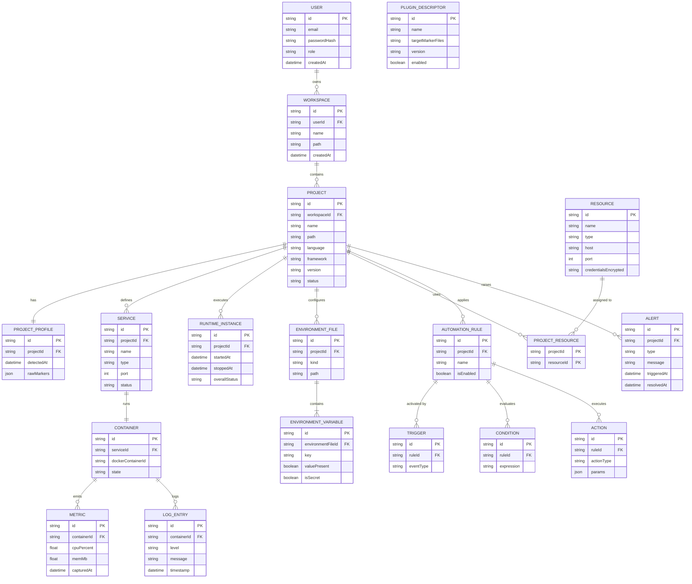

# DevVault — Análisis y Diseño del Sistema

## 1. Visión del producto

DevVault es una plataforma local que descubre, entiende y administra los ecosistemas de desarrollo de un desarrollador: no solo código, sino los servicios, variables de entorno, contenedores y automatizaciones que rodean a cada proyecto.

**Problema que resuelve:** cuando trabajas en varios proyectos, cada uno con su propio stack (Spring Boot, React, Postgres, Redis, Docker...), pierdes tiempo recordando cómo levantar cada uno, qué variables de entorno le faltan, o si un contenedor se cayó. DevVault centraliza eso.

**Usuario objetivo (v1):** tú mismo, un desarrollador que trabaja con múltiples proyectos locales. No hay multiusuario real en el MVP — la capa de Identity existe para dejar la puerta abierta a una versión colaborativa futura.

---

## 2. Requisitos funcionales

Agrupados por bounded context, con prioridad (M = MVP 0.1, S = 0.2, L = 0.3+).

### 2.1 Identity
| ID | Requisito | Prioridad |
|---|---|---|
| RF-01 | El sistema permite login local con usuario/contraseña | M |
| RF-02 | El sistema emite un JWT válido por sesión | M |
| RF-03 | El sistema soporta roles (ADMIN, USER) para preparar multiusuario futuro | S |

### 2.2 Workspace Management
| ID | Requisito | Prioridad |
|---|---|---|
| RF-04 | El usuario puede crear un Workspace apuntando a una ruta local (ej. `D:/Development`) | M |
| RF-05 | El usuario puede tener varios Workspaces | M |
| RF-06 | El sistema puede re-escanear un Workspace bajo demanda | M |

### 2.3 Project Discovery (Scanner Engine)
| ID | Requisito | Prioridad |
|---|---|---|
| RF-07 | El sistema recorre recursivamente las carpetas de un Workspace | M |
| RF-08 | El sistema detecta tecnología por archivos marcador (`pom.xml`, `package.json`, `composer.json`, etc.) | M |
| RF-09 | El sistema genera un Project Profile (lenguaje, framework, versión) por cada proyecto encontrado | M |
| RF-10 | El sistema permite extender la detección vía plugins sin tocar el núcleo | L |

### 2.4 Runtime Management
| ID | Requisito | Prioridad |
|---|---|---|
| RF-11 | El sistema detecta si un proyecto tiene `docker-compose.yml` | M |
| RF-12 | El usuario puede iniciar/detener/reiniciar un proyecto con un clic | S |
| RF-13 | El sistema reporta el estado de cada servicio (RUNNING, STOPPED, FAILED) | S |
| RF-14 | El sistema hace health check tras levantar los contenedores | S |

### 2.5 Resource Management
| ID | Requisito | Prioridad |
|---|---|---|
| RF-15 | El usuario puede registrar recursos compartidos (Postgres local, Redis, RabbitMQ) | S |
| RF-16 | Un recurso puede estar asociado a varios proyectos | S |

### 2.6 Environment Management
| ID | Requisito | Prioridad |
|---|---|---|
| RF-17 | El sistema lee y muestra variables de entorno (`.env`, `application.yml`) por proyecto | S |
| RF-18 | El sistema compara variables entre ambientes (dev vs prod) y marca faltantes | L |

### 2.7 Automation Engine
| ID | Requisito | Prioridad |
|---|---|---|
| RF-19 | El usuario puede definir reglas `trigger → condición → acción` | L |
| RF-20 | El sistema ejecuta acciones automáticas ante eventos (proyecto iniciado, contenedor caído) | L |

### 2.8 Monitoring
| ID | Requisito | Prioridad |
|---|---|---|
| RF-21 | El sistema muestra métricas básicas (CPU, RAM) de los contenedores activos | S |
| RF-22 | El sistema hace streaming de logs en vivo por servicio | S |
| RF-23 | El sistema genera alertas ante caída de un contenedor | L |

### 2.9 Plugin System
| ID | Requisito | Prioridad |
|---|---|---|
| RF-24 | El núcleo expone una interfaz `TechnologyPlugin` para agregar detección de nuevos stacks | L |

---

## 3. Requisitos no funcionales

| ID | Requisito |
|---|---|
| RNF-01 | Todo el sistema corre 100% local, sin dependencias de servicios pagos |
| RNF-02 | El escaneo de un Workspace con ~50 proyectos debe completarse en menos de 10s |
| RNF-03 | La arquitectura debe permitir extraer un módulo a microservicio sin reescribir su lógica de negocio (bajo acoplamiento entre bounded contexts) |
| RNF-04 | El acceso a la API de Docker no debe bloquear el hilo principal de la aplicación (operaciones asíncronas) |
| RNF-05 | Las credenciales de recursos (Resource Management) se almacenan cifradas, nunca en texto plano |
| RNF-06 | El sistema debe seguir funcionando (modo degradado) si Docker no está corriendo |

---

## 4. Casos de uso principales

**CU-01 — Registrar y escanear un Workspace**
Actor: Usuario. El usuario crea un Workspace señalando una carpeta local. El sistema dispara el Scanner Engine, que recorre el árbol de archivos, detecta tecnologías vía plugins y persiste un Project por cada carpeta reconocida como proyecto.

**CU-02 — Iniciar el entorno de un proyecto**
Actor: Usuario. Precondición: el proyecto tiene `docker-compose.yml` detectado. El sistema ejecuta `docker compose up`, monitorea el estado de cada contenedor, ejecuta health checks y actualiza el estado del proyecto a `RUNNING` o `FAILED` con el detalle del servicio que falló.

**CU-03 — Detectar variables de entorno faltantes**
Actor: Usuario. El sistema lee el `.env.example` (o equivalente) y el `.env` real, calcula la diferencia y la muestra como alerta en el dashboard del proyecto.

**CU-04 — Reaccionar automáticamente a un evento**
Actor: Sistema (disparado por evento interno). Cuando `Runtime Management` emite el evento `ContainerFailed`, el `Automation Engine` evalúa las reglas activas y ejecuta la acción configurada (ej. notificación).

---

## 5. Modelo de dominio: reglas de negocio

Las entidades completas con sus atributos están en el ERD de la sección 6. Aquí quedan las reglas de negocio que ese diagrama no puede expresar y que debes validar en la capa de aplicación (no solo confiar en las constraints de la base de datos):
- Un `Project` pertenece a un único `Workspace`; un `Workspace` a un único `User`.
- Un `Resource` puede asociarse a N `Project` y viceversa (tabla puente).
- Un `RuntimeInstance` agrupa el estado de todos los `Container` de un `Project` en un momento dado — el estado global es `RUNNING` solo si todos sus servicios pasan el health check.
- Una `AutomationRule` sin `Trigger` no puede activarse (invariante de validación al guardar).

---

## 6. Diagrama entidad-relación completo



**Notas sobre el modelo:**
- `PROJECT ||--|| PROJECT_PROFILE` es 1:1 — cada proyecto tiene exactamente un perfil vigente (si quieres histórico de detecciones, esto pasaría a 1:N con un campo `isCurrent`).
- `SERVICE ||--|| CONTAINER` es 1:1 en el modelo actual, pero en la práctica un `Service` (ej. réplicas) podría tener varios `Container` — vale la pena decidir esto antes de escribir el repositorio, porque cambia la cardinalidad de la FK.
- `PROJECT_RESOURCE` es la tabla puente N:M entre `PROJECT` y `RESOURCE`, con clave compuesta.
- Ningún atributo está marcado `NOT NULL` explícitamente en el ERD — defínelo al escribir las entidades JPA, especialmente en `PROJECT.workspaceId`, `SERVICE.projectId` y los demás FK, que nunca deberían ser nulos.

---

## 7. Diseño de API REST (v1)

Prefijo base: `/api/v1`

### Identity
```
POST   /auth/login              → { token }
GET    /auth/me                 → perfil del usuario autenticado
```

### Workspace
```
POST   /workspaces              → crea un Workspace
GET    /workspaces              → lista Workspaces del usuario
POST   /workspaces/{id}/scan    → dispara un escaneo (asíncrono, devuelve 202)
GET    /workspaces/{id}/scan/status → estado del último escaneo
```

### Project
```
GET    /projects?workspaceId=   → lista proyectos
GET    /projects/{id}           → detalle + profile detectado
```

### Runtime
```
POST   /projects/{id}/start     → inicia el entorno (202, asíncrono)
POST   /projects/{id}/stop      → detiene el entorno
GET    /projects/{id}/status    → estado agregado de servicios
GET    /projects/{id}/services  → lista de Service + Container
WS     /projects/{id}/logs      → streaming de logs en vivo
```

### Resource
```
POST   /resources               → registra un recurso compartido
GET    /resources                → lista recursos
POST   /projects/{id}/resources/{resourceId} → asocia recurso a proyecto
```

### Environment
```
GET    /projects/{id}/environment           → variables detectadas
GET    /projects/{id}/environment/diff      → variables faltantes vs plantilla
```

### Automation
```
POST   /automation/rules        → crea regla
GET    /automation/rules        → lista reglas
PATCH  /automation/rules/{id}   → habilita/deshabilita
```

### Monitoring
```
GET    /projects/{id}/metrics   → métricas recientes de CPU/RAM
GET    /alerts                  → alertas activas
```

---

## 8. Arquitectura técnica: modular monolith

Un solo deployable, pero con módulos internos aislados por paquete y con comunicación por eventos internos (no llamadas directas cruzadas entre módulos de negocio).

```
com.devvault
├── identity
│   ├── domain          (User, Role)
│   ├── application      (LoginUseCase, JwtService)
│   ├── infrastructure    (UserRepository, SecurityConfig)
│   └── api               (AuthController)
├── workspace
│   ├── domain
│   ├── application
│   ├── infrastructure
│   └── api
├── discovery
│   ├── domain           (Project, ProjectProfile)
│   ├── application       (ScannerEngine, ScanUseCase)
│   ├── plugin             (TechnologyPlugin interface + implementaciones)
│   ├── infrastructure
│   └── api
├── runtime
│   ├── domain            (Service, Container, RuntimeInstance)
│   ├── application         (StartProjectUseCase, HealthCheckService)
│   ├── infrastructure        (DockerClientAdapter)
│   └── api
├── resource
├── environment
├── automation
│   ├── domain              (AutomationRule, Trigger, Condition, Action)
│   ├── application           (RuleEvaluator, EventListener)
│   └── infrastructure
├── monitoring
├── plugin
├── shared
│   ├── events               (DomainEvent, EventBus)
│   └── config
└── DevVaultApplication.java
```

**Regla de oro del modular monolith:** un módulo nunca importa clases de `domain` de otro módulo directamente. Si `runtime` necesita reaccionar a algo de `discovery`, se comunica vía un evento de dominio (`ProjectDiscoveredEvent`) publicado en un `ApplicationEventPublisher` de Spring — así el día de mañana puedes extraer `runtime` a un microservicio cambiando solo la infraestructura de mensajería, sin tocar la lógica de negocio.

---

## 9. Flujo de eventos internos (Automation Engine como consumidor)

```
discovery.ProjectDiscoveredEvent   ──┐
runtime.ContainerFailedEvent       ──┼──►  EventBus (Spring ApplicationEvent)
runtime.ProjectStartedEvent        ──┘              │
                                                      ▼
                                          automation.RuleEvaluator
                                                      │
                                        ¿alguna regla activa coincide?
                                                      │
                                              automation.ActionExecutor
                                          (notificación, abrir VSCode, etc.)
```

---

## 10. Stack técnico por capa

| Capa | Tecnología |
|---|---|
| Backend | Spring Boot 3.x, Spring Data JPA, Spring Security |
| Base de datos | PostgreSQL |
| Cache / eventos async | Redis |
| Cola (para automatizaciones pesadas) | RabbitMQ |
| Acceso a Docker | Docker Engine API (vía socket) |
| Frontend | React + WebSockets (logs en vivo) |
| Observabilidad propia | Micrometer + Prometheus + Grafana (opcional, fase 0.3) |
| Contenerización | Docker Compose (local) |

---

## 11. Roadmap de versiones

**v0.1 — MVP**
Login local · Crear Workspace · Escanear proyectos · Detectar tecnologías (2 plugins: Spring y Node/React) · Mostrar proyectos en dashboard · Leer Git básico

**v0.2**
Docker management (start/stop/restart) · Logs en vivo · Estado de servicios · Health checks

**v0.3**
Automation Engine · Sistema de plugins abierto · Monitoring con métricas

**v1.0**
Resource Management completo · Environment diffing · Plataforma estable, documentada, lista para uso diario real

---

## 12. Riesgos técnicos a validar temprano

- **Acceso al socket de Docker desde Java:** validar con una prueba de concepto aislada antes de construir todo el módulo `runtime` encima — es el punto de mayor incertidumbre técnica del proyecto.
- **Rendimiento del escaneo recursivo:** en Workspaces grandes, evaluar si conviene usar `Files.walkFileTree` con poda temprana (ignorar `node_modules`, `.git`, `target`) para no recorrer millones de archivos innecesarios.
- **Consistencia de estado runtime vs Docker real:** si alguien detiene un contenedor desde la terminal, DevVault debe detectarlo (polling periódico o eventos de Docker) para no mostrar estado desactualizado.
