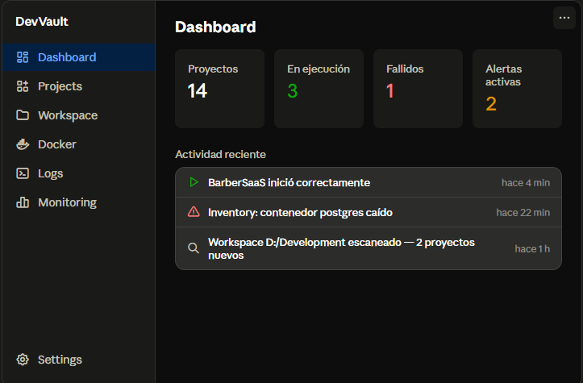
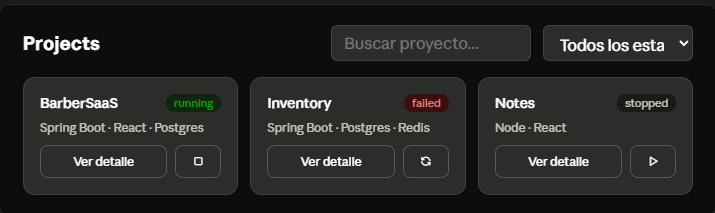
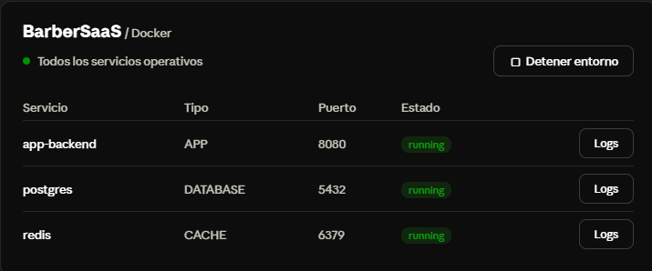
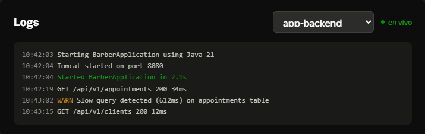
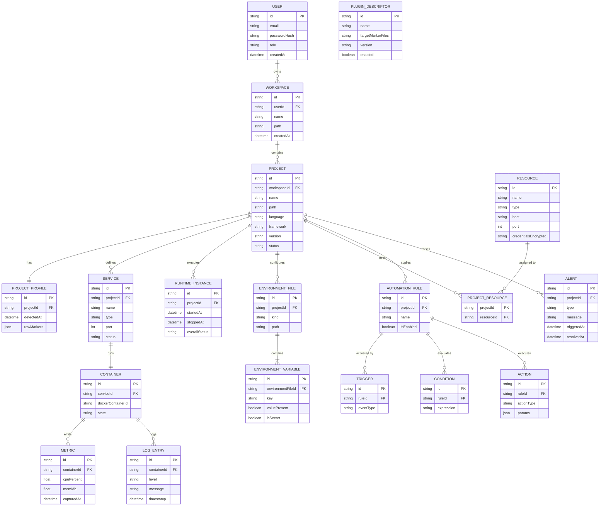

## Product Specification


## 1. Casos de uso

### CU-01 — Iniciar sesión
- **Actor:** Usuario
- **Precondición:** el usuario tiene una cuenta creada localmente
- **Flujo principal:**
  1. El usuario envía email y contraseña
  2. El sistema valida credenciales contra `User`
  3. El sistema genera y devuelve un JWT
- **Flujo alterno:** credenciales inválidas → `401 Unauthorized`, sin detalle de si el email existe (evitar user enumeration)
- **Postcondición:** el usuario queda autenticado para las siguientes peticiones

### CU-02 — Cerrar sesión
- **Actor:** Usuario
- **Precondición:** sesión activa (JWT válido)
- **Flujo principal:** el cliente descarta el token; si se implementa blacklist de tokens, el sistema lo invalida server-side
- **Postcondición:** el token deja de ser aceptado por el sistema

### CU-03 — Crear y escanear un Workspace
- **Actor:** Usuario
- **Precondición:** el usuario está autenticado y la ruta local indicada existe y es accesible
- **Flujo principal:**
  1. El usuario crea un `Workspace` indicando nombre y ruta local
  2. El sistema dispara el Scanner Engine de forma asíncrona (`202 Accepted`)
  3. El scanner recorre el árbol de archivos, podando carpetas irrelevantes (`node_modules`, `.git`, `target`)
  4. Por cada carpeta con marcador reconocido, se ejecuta el `TechnologyPlugin` correspondiente
  5. Se persiste un `Project` + `ProjectProfile` por cada proyecto detectado
- **Flujos alternos:**
  - Ruta inaccesible → error `422` con mensaje claro, no se crea el Workspace
  - Carpeta sin marcadores reconocidos → se ignora, no genera error
  - Re-escaneo de un Workspace existente → actualiza `ProjectProfile` de proyectos ya conocidos y agrega los nuevos
- **Postcondición:** el Workspace queda poblado con los `Project` detectados, consultables vía `GET /projects`

### CU-04 — Ver detalle de un proyecto detectado
- **Actor:** Usuario
- **Precondición:** el proyecto fue detectado previamente por CU-03
- **Flujo principal:** el usuario consulta `GET /projects/{id}` y el sistema devuelve lenguaje, framework, versión, estado y los `Service` asociados si ya fueron detectados
- **Postcondición:** ninguna (operación de solo lectura)

### CU-05 — Iniciar el entorno de un proyecto
- **Actor:** Usuario
- **Precondición:** el proyecto tiene `docker-compose.yml` detectado y Docker está corriendo en el host
- **Flujo principal:**
  1. El usuario solicita `POST /projects/{id}/start`
  2. El sistema responde `202 Accepted` y ejecuta `docker compose up` de forma asíncrona
  3. Se crea un `RuntimeInstance` con `startedAt`
  4. Por cada contenedor levantado se crea/actualiza un `Container` con su estado
  5. El sistema ejecuta health checks sobre cada `Service`
  6. Cuando todos los servicios pasan el health check, `RuntimeInstance.overallStatus = RUNNING`
- **Flujos alternos:**
  - Docker no está corriendo → `503`, el proyecto queda en estado `FAILED` con causa explícita
  - Un servicio falla el health check → `RuntimeInstance.overallStatus = FAILED`, se indica cuál servicio falló
  - El proyecto ya está corriendo → operación idempotente, devuelve el estado actual sin relanzar
- **Postcondición:** el proyecto queda en estado `RUNNING` o `FAILED`, consultable en tiempo real

### CU-06 — Detener el entorno de un proyecto
- **Actor:** Usuario
- **Precondición:** el proyecto tiene un `RuntimeInstance` activo
- **Flujo principal:** el usuario solicita `POST /projects/{id}/stop`, el sistema ejecuta `docker compose down`, actualiza cada `Container` y cierra el `RuntimeInstance` con `stoppedAt`
- **Postcondición:** el proyecto queda en estado `STOPPED`

### CU-07 — Ver estado y logs en vivo de los servicios
- **Actor:** Usuario
- **Precondición:** el proyecto está `RUNNING`
- **Flujo principal:**
  1. El usuario consulta `GET /projects/{id}/services` para ver el estado agregado
  2. El usuario abre el canal `WS /projects/{id}/logs` para un servicio específico
  3. El sistema hace streaming de `docker logs -f` a través del WebSocket
- **Flujo alterno:** el contenedor se cae mientras el usuario ve logs → el sistema notifica el cierre del stream con el motivo
- **Postcondición:** ninguna (observación en tiempo real)

### CU-08 — Registrar un recurso compartido
- **Actor:** Usuario
- **Precondición:** ninguna
- **Flujo principal:** el usuario registra un `Resource` (ej. PostgreSQL local) con host, puerto y credenciales; el sistema cifra las credenciales antes de persistirlas (RNF-05)
- **Postcondición:** el recurso queda disponible para asociarse a proyectos

### CU-09 — Asociar un recurso a un proyecto
- **Actor:** Usuario
- **Precondición:** el `Resource` y el `Project` existen
- **Flujo principal:** el usuario solicita `POST /projects/{id}/resources/{resourceId}`, el sistema crea el registro en `ProjectResource`
- **Flujo alterno:** el recurso ya está asociado → operación idempotente, no duplica
- **Postcondición:** el recurso aparece listado en el detalle del proyecto

### CU-10 — Ver diferencias de variables de entorno
- **Actor:** Usuario
- **Precondición:** el proyecto tiene al menos un archivo `.env` o `.env.example` detectado
- **Flujo principal:**
  1. El sistema lee las claves presentes en el archivo plantilla (`.env.example`) y en el archivo real (`.env`)
  2. El sistema calcula la diferencia (claves presentes en la plantilla pero ausentes en el real)
  3. El usuario consulta `GET /projects/{id}/environment/diff` y ve las variables faltantes
- **Nota de diseño:** el sistema nunca expone el *valor* de una variable marcada `isSecret`, solo si está presente o no
- **Postcondición:** ninguna (operación de solo lectura)

### CU-11 — Definir una regla de automatización
- **Actor:** Usuario
- **Precondición:** el usuario está autenticado
- **Flujo principal:** el usuario crea una `AutomationRule` con al menos un `Trigger`, opcionalmente `Condition`, y al menos una `Action`
- **Flujo alterno:** regla sin `Trigger` → rechazada con `400` (invariante de negocio, no puede activarse una regla que nunca dispara)
- **Postcondición:** la regla queda activa y será evaluada ante los eventos que coincidan con su `Trigger`

### CU-12 — Ejecutar una automatización ante un evento (caso de uso del sistema)
- **Actor:** Sistema (disparado internamente, no por el usuario)
- **Precondición:** existe al menos una `AutomationRule` habilitada
- **Flujo principal:**
  1. Un módulo publica un evento de dominio (ej. `runtime.ContainerFailedEvent`)
  2. El `RuleEvaluator` del módulo Automation recibe el evento vía el EventBus
  3. Evalúa qué reglas tienen un `Trigger` que coincide con el tipo de evento
  4. Para cada regla coincidente, evalúa sus `Condition` (si las tiene)
  5. Si las condiciones se cumplen, ejecuta cada `Action` asociada
- **Flujo alterno:** la acción falla (ej. no se pudo enviar la notificación) → se registra en `LogEntry`/`Alert`, no interrumpe la evaluación de otras reglas
- **Postcondición:** las acciones configuradas quedan ejecutadas o registrado el motivo de fallo

### CU-13 — Ver métricas y alertas de un proyecto
- **Actor:** Usuario
- **Precondición:** el proyecto tiene o tuvo un `RuntimeInstance` con contenedores activos
- **Flujo principal:** el usuario consulta `GET /projects/{id}/metrics` para ver CPU/RAM recientes por contenedor, y `GET /alerts` para ver alertas activas o resueltas
- **Postcondición:** ninguna (operación de solo lectura)

---

## 2. Historias de usuario


Formato: `Como [rol], quiero [acción], para [beneficio]`, con criterios de aceptación en Gherkin y trazabilidad a los RF/CU definidos antes. Estimación en talla de camiseta (S/M/L) solo como referencia de esfuerzo relativo.

### HU-01 — Acceder a la aplicación sin fricción
**Como** desarrollador, **quiero** poder usar DevVault sin tener que crear una cuenta ni iniciar sesión, **para** empezar a usarla de inmediato en el MVP.
- **Criterios de aceptación:**
  - Dado que abro DevVault por primera vez, cuando accedo a cualquier endpoint, entonces no se me pide autenticación
  - Dado que el módulo Identity existe en el código, cuando reviso la configuración de seguridad, entonces está explícito que `permitAll()` es temporal (comentario o flag `auth.enabled=false`)
- **Prioridad:** Alta · **Estimación:** S
- **Trazabilidad:** RF-01/RF-02 (diferidos), decisión de diseño de la conversación anterior

### HU-02 — Crear un Workspace
**Como** desarrollador, **quiero** registrar una carpeta local como Workspace, **para** que DevVault sepa dónde buscar mis proyectos.
- **Criterios de aceptación:**
  - Dado que envío una ruta válida y existente, cuando creo el Workspace, entonces se persiste y recibo su `id`
  - Dado que envío una ruta que no existe o no es accesible, cuando intento crear el Workspace, entonces recibo `422` con un mensaje claro
  - Dado que ya tengo un Workspace con esa misma ruta, cuando intento crear otro igual, entonces el sistema lo rechaza o lo identifica como duplicado
- **Prioridad:** Alta · **Estimación:** S
- **Trazabilidad:** RF-04, CU-03

### HU-03 — Listar mis Workspaces
**Como** desarrollador, **quiero** ver todos los Workspaces que he creado, **para** elegir cuál quiero escanear o revisar.
- **Criterios de aceptación:**
  - Dado que tengo Workspaces creados, cuando consulto `GET /workspaces`, entonces recibo la lista con nombre, ruta y fecha de creación
  - Dado que no tengo ninguno, cuando consulto el endpoint, entonces recibo una lista vacía, no un error
- **Prioridad:** Media · **Estimación:** S
- **Trazabilidad:** RF-05

### HU-04 — Escanear un Workspace para descubrir proyectos
**Como** desarrollador, **quiero** que DevVault recorra la carpeta de mi Workspace, **para** descubrir automáticamente qué proyectos tengo sin registrarlos a mano.
- **Criterios de aceptación:**
  - Dado un Workspace válido, cuando disparo `POST /workspaces/{id}/scan`, entonces recibo `202` y el escaneo corre en segundo plano
  - Dado que el escaneo terminó, cuando consulto `GET /workspaces/{id}/scan/status`, entonces veo si sigue en curso, terminó o falló
  - Dado que el Workspace tiene carpetas como `node_modules` o `.git`, cuando el scanner recorre el árbol, entonces esas carpetas se ignoran y no se procesan como proyectos
- **Prioridad:** Alta · **Estimación:** M
- **Trazabilidad:** RF-07, CU-03, RNF-02

### HU-05 — Detectar un proyecto Spring Boot
**Como** desarrollador, **quiero** que DevVault reconozca automáticamente un proyecto Java/Spring Boot, **para** no tener que clasificarlo manualmente.
- **Criterios de aceptación:**
  - Dado que una carpeta contiene `pom.xml` con dependencia de `spring-boot-starter`, cuando el scanner la procesa, entonces se crea un `Project` con `language=Java`, `framework=Spring Boot`
  - Dado que el `pom.xml` indica una versión de Spring Boot, cuando se detecta, entonces esa versión queda guardada en `ProjectProfile`
  - Dado un `pom.xml` sin ninguna dependencia de Spring, cuando se procesa, entonces se detecta como `Java` genérico, no como `Spring Boot`
- **Prioridad:** Alta · **Estimación:** M
- **Trazabilidad:** RF-08, RF-09

### HU-06 — Detectar un proyecto React/Node
**Como** desarrollador, **quiero** que DevVault reconozca automáticamente un proyecto frontend en Node/React, **para** tener el mismo nivel de detección que en mis proyectos backend.
- **Criterios de aceptación:**
  - Dado que una carpeta contiene `package.json` con `react` en `dependencies`, cuando el scanner la procesa, entonces se crea un `Project` con `language=JavaScript/TypeScript`, `framework=React`
  - Dado un `package.json` sin `react`, cuando se procesa, entonces se detecta como `Node` genérico
- **Prioridad:** Alta · **Estimación:** M
- **Trazabilidad:** RF-08, RF-09

### HU-07 — Ver el dashboard de proyectos detectados
**Como** desarrollador, **quiero** ver en un solo lugar todos los proyectos que DevVault ha detectado, **para** tener una visión general de mi trabajo sin abrir carpeta por carpeta.
- **Criterios de aceptación:**
  - Dado que tengo proyectos detectados, cuando consulto `GET /projects?workspaceId=`, entonces veo nombre, lenguaje, framework y estado de cada uno
  - Dado que filtro por Workspace, cuando consulto el endpoint, entonces solo veo los proyectos de ese Workspace
- **Prioridad:** Alta · **Estimación:** S
- **Trazabilidad:** RF-09, CU-04

### HU-08 — Ver el detalle de un proyecto
**Como** desarrollador, **quiero** ver la información completa de un proyecto específico, **para** confirmar que DevVault lo entendió correctamente.
- **Criterios de aceptación:**
  - Dado un proyecto existente, cuando consulto `GET /projects/{id}`, entonces veo su `ProjectProfile` completo incluyendo los marcadores crudos que se usaron para detectarlo (`rawMarkers`)
- **Prioridad:** Media · **Estimación:** S
- **Trazabilidad:** CU-04

### HU-09 — Re-escanear un Workspace ya existente
**Como** desarrollador, **quiero** volver a escanear un Workspace después de crear un proyecto nuevo en esa carpeta, **para** que DevVault se mantenga actualizado sin tener que recrear el Workspace.
- **Criterios de aceptación:**
  - Dado un Workspace ya escaneado, cuando disparo un nuevo escaneo, entonces los proyectos ya conocidos se actualizan (no se duplican) y los nuevos se agregan
  - Dado que un proyecto fue eliminado físicamente de disco, cuando se re-escanea, entonces su estado cambia a algo como `NOT_FOUND` en vez de desaparecer silenciosamente (decisión a validar: ¿se borra o se marca?)
- **Prioridad:** Media · **Estimación:** M
- **Trazabilidad:** RF-06

### HU-10 — Ver información básica de Git de un proyecto
**Como** desarrollador, **quiero** ver la rama actual y el último commit de cada proyecto detectado, **para** recordar en qué quedé sin tener que abrir la terminal.
- **Criterios de aceptación:**
  - Dado que un proyecto tiene carpeta `.git`, cuando consulto su detalle, entonces veo la rama activa, el hash corto del último commit y su fecha
  - Dado que un proyecto no tiene `.git`, cuando consulto su detalle, entonces esta sección simplemente no aparece, sin generar error
- **Prioridad:** Baja (nice-to-have del 0.1, puede moverse a 0.2 si el tiempo aprieta) · **Estimación:** S
- **Trazabilidad:** roadmap "Leer Git básico" (agrégalo como RF-25 en la tabla de requisitos si formalizas esto)

---

### Resumen de alcance del sprint/MVP

| HU | Prioridad | Estimación |
|---|---|---|
| HU-01 Acceso sin fricción | Alta | S |
| HU-02 Crear Workspace | Alta | S |
| HU-03 Listar Workspaces | Media | S |
| HU-04 Escanear Workspace | Alta | M |
| HU-05 Detectar Spring Boot | Alta | M |
| HU-06 Detectar React/Node | Alta | M |
| HU-07 Dashboard de proyectos | Alta | S |
| HU-08 Detalle de proyecto | Media | S |
| HU-09 Re-escanear Workspace | Media | M |
| HU-10 Info básica de Git | Baja | S |

Si necesitas recortar alcance para entregar más rápido, **HU-10 es la primera candidata a moverse a 0.2** — no es crítica para validar el concepto central (que el scanner funcione y detecte tecnologías correctamente).

---

### 3. Reglas de negocio

Aquí tienes solo las reglas de negocio, consolidadas de todo lo que hemos definido hasta ahora (agrupadas por contexto, sin el resto del documento):

### Identity
- El sistema nunca revela si un email existe o no ante un intento de login fallido (evita *user enumeration*), solo responde `401` genérico.

### Workspace Management
- Una ruta local no puede registrarse dos veces como Workspace (evita duplicados apuntando a la misma carpeta).
- Una ruta inaccesible o inexistente impide la creación del Workspace — no se crea en estado "pendiente" ni similar.

### Project Discovery
- Un `Project` pertenece a un único `Workspace`; un `Workspace` pertenece a un único `User`.
- Una carpeta sin ningún marcador reconocido (`pom.xml`, `package.json`, etc.) se ignora silenciosamente — no genera error ni se registra como proyecto.
- Al re-escanear un Workspace: los proyectos ya conocidos se **actualizan**, no se duplican; los nuevos se agregan.
- *(Pendiente de decisión)* si un proyecto detectado antes desaparece físicamente de disco, ¿se elimina de la base de datos o se marca como `NOT_FOUND` conservando el historial?
- *(Pendiente de decisión)* `Project ↔ ProjectProfile` es 1:1 (solo el perfil vigente); si se requiere histórico de detecciones, pasa a 1:N con un flag `isCurrent`.
- Carpetas técnicas (`node_modules`, `.git`, `target`) se podan del recorrido y nunca se evalúan como proyectos.

### Runtime Management
- El estado global de un `RuntimeInstance` es `RUNNING` **solo si todos** sus `Service` asociados pasan el health check — no basta con que los contenedores estén "levantados".
- Iniciar un proyecto que ya está `RUNNING` es una operación **idempotente**: no se relanza, se devuelve el estado actual.
- Si Docker no está corriendo en el host, el proyecto pasa a `FAILED` con la causa explícita — el sistema debe seguir operando en modo degradado (no se cae toda la aplicación).
- *(Pendiente de decisión)* `Service ↔ Container` es 1:1 en el modelo actual; si se contemplan réplicas de un mismo servicio, debe pasar a 1:N.

### Resource Management
- Un `Resource` puede asociarse a N `Project` y viceversa (relación N:M vía `ProjectResource`).
- Asociar un recurso ya asociado a un proyecto es **idempotente**: no genera duplicados.
- Las credenciales de un `Resource` se almacenan **siempre cifradas**, nunca en texto plano.

### Environment Management
- El sistema **nunca expone el valor** de una variable marcada `isSecret`, solo si está presente o ausente respecto a la plantilla.

### Automation Engine
- Una `AutomationRule` **sin `Trigger`** no puede guardarse como habilitada — invariante de validación al crear/editar la regla.
- Si la ejecución de una `Action` falla, se registra el fallo pero **no interrumpe** la evaluación de las demás reglas activas para ese mismo evento.

### Transversales
- Todas las FK entre entidades (`workspaceId`, `projectId`, `serviceId`, etc.) son obligatorias — ninguna relación queda huérfana por diseño.

---

# Fase 3 — Arquitectura

## Decisión arquitectónica: modular monolith (no microservicios)



Para el tamaño y etapa de este proyecto, microservicios sería sobre-ingeniería: más complejidad operativa (orquestación, red, observabilidad distribuida) sin un beneficio real todavía. El modular monolith te da separación de responsabilidades real sin ese costo, y deja la puerta abierta a extraer un módulo a microservicio el día que haga falta.

## Estructura de paquetes

```
com.devvault
├── identity        (domain · application · infrastructure · api)
├── workspace        (domain · application · infrastructure · api)
├── discovery         (domain · application · plugin · infrastructure · api)
├── runtime            (domain · application · infrastructure · api)
├── resource
├── environment
├── automation          (domain · application · infrastructure)
├── monitoring
├── plugin
├── shared
│   ├── events              (DomainEvent, EventBus)
│   └── config
└── DevVaultApplication.java
```

Cada módulo replica el mismo patrón interno: `domain` (entidades y reglas), `application` (casos de uso), `infrastructure` (repositorios, adaptadores externos) y `api` (controladores REST).

## Regla de oro: comunicación entre módulos

**Un módulo nunca importa clases de `domain` de otro módulo directamente.** Toda comunicación cruzada pasa por el event bus (`ApplicationEventPublisher` de Spring). Ejemplo: `runtime` no llama directo a `automation`; publica `ContainerFailedEvent` y `automation` lo escucha.

Esto es lo que hace que, si mañana quieres extraer `runtime` a un microservicio, solo cambias la infraestructura de mensajería (de `ApplicationEventPublisher` a RabbitMQ real) sin tocar una sola línea de lógica de negocio.

## Stack por capa

| Capa | Tecnología | Rol |
|---|---|---|
| Frontend | React + WebSockets | UI y logs en vivo |
| Backend | Spring Boot 3.x, Spring Data JPA, Spring Security | API REST y lógica de negocio |
| Persistencia | PostgreSQL | Datos transaccionales |
| Cache / eventos async | Redis | Soporte a operaciones rápidas y pub/sub liviano |
| Cola | RabbitMQ | Automatizaciones pesadas (fase 0.3) |
| Acceso a contenedores | Docker Engine API (socket) | Módulo `runtime` |
| Control de versiones | Git API (JGit o similar) | HU-10, info de Git por proyecto |
| Observabilidad | Micrometer + Prometheus + Grafana | Opcional, fase 0.3 |
| Orquestación local | Docker Compose | Todo el stack corre en tu máquina |


---

# Fase 4 — UI/UX


**1. Layout base — sidebar de navegación****Decisiones de UX en esta pantalla:** las 4 métricas de arriba responden la primera pregunta que te vas a hacer al abrir la app ("¿todo bien?") sin scroll. El feed de actividad reciente reutiliza los eventos internos que ya definimos en el Automation Engine (CU-12) — es el mismo dato, solo presentado como timeline.



**2. Projects — vista principal de trabajo diario** **Decisión clave:** cada tarjeta tiene una acción rápida (start/stop/restart) sin entrar al detalle — esto mapea directo a CU-05/CU-06. El botón "Ver detalle" es el que te lleva a la vista de Docker/servicios de ese proyecto específico.



**3. Docker — vista de servicios de un proyecto (donde vive CU-05, CU-06, CU-07)**




**4. Logs — streaming en vivo (WebSocket, CU-07)** 



- **Workspace:** lista de Workspaces registrados (nombre, ruta, cantidad de proyectos, fecha del último escaneo) + botón "Escanear ahora" por fila, y un modal simple para crear uno nuevo (input de ruta local)
- **Monitoring:** grid de tarjetas por contenedor con CPU/RAM actual (gauge simple o número + barra), y debajo un feed de alertas activas/resueltas — reutiliza el mismo componente de "actividad reciente" del Dashboard
- **Settings:** formulario simple: ruta por defecto de escaneo, activar/desactivar autenticación (HU-01), gestión de `Resource` registrados, y la lista de `PluginDescriptor` habilitados/deshabilitados


---

# Fase 5 — Arquitectura de Base de Datos


### ERD

## 6. Diagrama entidad-relación completo



**Notas sobre el modelo:**
- `PROJECT ||--|| PROJECT_PROFILE` es 1:1 — cada proyecto tiene exactamente un perfil vigente (si quieres histórico de detecciones, esto pasaría a 1:N con un campo `isCurrent`).
- `SERVICE ||--|| CONTAINER` es 1:1 en el modelo actual, pero en la práctica un `Service` (ej. réplicas) podría tener varios `Container` — vale la pena decidir esto antes de escribir el repositorio, porque cambia la cardinalidad de la FK.
- `PROJECT_RESOURCE` es la tabla puente N:M entre `PROJECT` y `RESOURCE`, con clave compuesta.
- Ningún atributo está marcado `NOT NULL` explícitamente en el ERD — defínelo al escribir las entidades JPA, especialmente en `PROJECT.workspaceId`, `SERVICE.projectId` y los demás FK, que nunca deberían ser nulos.

---
## Entidades

Tablas derivadas del ERD, con tipos concretos para PostgreSQL (convención `snake_case`, PK como `UUID`).

```sql
-- IDENTITY
users (
  id UUID PK,
  email VARCHAR(255) UNIQUE NOT NULL,
  password_hash VARCHAR(255) NOT NULL,
  role VARCHAR(20) NOT NULL,          -- ADMIN, USER
  created_at TIMESTAMPTZ NOT NULL DEFAULT now()
)

-- WORKSPACE MANAGEMENT
workspaces (
  id UUID PK,
  user_id UUID NOT NULL,
  name VARCHAR(120) NOT NULL,
  path TEXT NOT NULL,
  created_at TIMESTAMPTZ NOT NULL DEFAULT now()
)

-- PROJECT DISCOVERY
projects (
  id UUID PK,
  workspace_id UUID NOT NULL,
  name VARCHAR(120) NOT NULL,
  path TEXT NOT NULL,
  language VARCHAR(50),
  framework VARCHAR(50),
  version VARCHAR(30),
  status VARCHAR(20) NOT NULL          -- ACTIVE, NOT_FOUND, ARCHIVED
)

project_profiles (
  id UUID PK,
  project_id UUID NOT NULL UNIQUE,     -- 1:1 con projects
  detected_at TIMESTAMPTZ NOT NULL,
  raw_markers JSONB
)

-- RUNTIME MANAGEMENT
services (
  id UUID PK,
  project_id UUID NOT NULL,
  name VARCHAR(80) NOT NULL,
  type VARCHAR(30) NOT NULL,           -- DATABASE, CACHE, QUEUE, APP...
  port INT,
  status VARCHAR(20) NOT NULL
)

containers (
  id UUID PK,
  service_id UUID NOT NULL,
  docker_container_id VARCHAR(64),
  state VARCHAR(20) NOT NULL
)

runtime_instances (
  id UUID PK,
  project_id UUID NOT NULL,
  started_at TIMESTAMPTZ,
  stopped_at TIMESTAMPTZ,
  overall_status VARCHAR(20) NOT NULL  -- RUNNING, STOPPED, FAILED
)

-- RESOURCE MANAGEMENT
resources (
  id UUID PK,
  name VARCHAR(120) NOT NULL,
  type VARCHAR(30) NOT NULL,
  host VARCHAR(255) NOT NULL,
  port INT NOT NULL,
  credentials_encrypted TEXT NOT NULL
)

project_resources (
  project_id UUID,
  resource_id UUID,
  PK (project_id, resource_id)         -- tabla puente N:M
)

-- ENVIRONMENT MANAGEMENT
environment_files (
  id UUID PK,
  project_id UUID NOT NULL,
  kind VARCHAR(20) NOT NULL,           -- ENV, APPLICATION_YML...
  path TEXT NOT NULL
)

environment_variables (
  id UUID PK,
  environment_file_id UUID NOT NULL,
  key VARCHAR(150) NOT NULL,
  value_present BOOLEAN NOT NULL,
  is_secret BOOLEAN NOT NULL DEFAULT false
)

-- AUTOMATION ENGINE
automation_rules (
  id UUID PK,
  project_id UUID,                     -- nullable: puede ser regla global
  name VARCHAR(120) NOT NULL,
  is_enabled BOOLEAN NOT NULL DEFAULT true
)

triggers (
  id UUID PK,
  rule_id UUID NOT NULL,
  event_type VARCHAR(80) NOT NULL
)

conditions (
  id UUID PK,
  rule_id UUID NOT NULL,
  expression TEXT NOT NULL
)

actions (
  id UUID PK,
  rule_id UUID NOT NULL,
  action_type VARCHAR(50) NOT NULL,
  params JSONB
)

-- MONITORING
metrics (
  id UUID PK,
  container_id UUID NOT NULL,
  cpu_percent REAL,
  mem_mb REAL,
  captured_at TIMESTAMPTZ NOT NULL
)

log_entries (
  id UUID PK,
  container_id UUID NOT NULL,
  level VARCHAR(10) NOT NULL,
  message TEXT NOT NULL,
  timestamp TIMESTAMPTZ NOT NULL
)

alerts (
  id UUID PK,
  project_id UUID NOT NULL,
  type VARCHAR(50) NOT NULL,
  message TEXT NOT NULL,
  triggered_at TIMESTAMPTZ NOT NULL,
  resolved_at TIMESTAMPTZ
)

-- PLUGIN SYSTEM
plugin_descriptors (
  id UUID PK,
  name VARCHAR(80) NOT NULL,
  target_marker_files TEXT NOT NULL,   -- ej: "pom.xml,package.json"
  version VARCHAR(20) NOT NULL,
  enabled BOOLEAN NOT NULL DEFAULT true
)
```

## Relaciones

| FK | Tabla origen | Tabla destino | Cardinalidad | ON DELETE |
|---|---|---|---|---|
| `workspaces.user_id` | workspaces | users | N:1 | CASCADE |
| `projects.workspace_id` | projects | workspaces | N:1 | CASCADE |
| `project_profiles.project_id` | project_profiles | projects | 1:1 | CASCADE |
| `services.project_id` | services | projects | N:1 | CASCADE |
| `containers.service_id` | containers | services | N:1 (hoy 1:1 real) | CASCADE |
| `runtime_instances.project_id` | runtime_instances | projects | N:1 | CASCADE |
| `project_resources.project_id` | project_resources | projects | N:M (puente) | CASCADE |
| `project_resources.resource_id` | project_resources | resources | N:M (puente) | RESTRICT |
| `environment_files.project_id` | environment_files | projects | N:1 | CASCADE |
| `environment_variables.environment_file_id` | environment_variables | environment_files | N:1 | CASCADE |
| `automation_rules.project_id` | automation_rules | projects | N:1 (nullable) | CASCADE |
| `triggers.rule_id` | triggers | automation_rules | N:1 | CASCADE |
| `conditions.rule_id` | conditions | automation_rules | N:1 | CASCADE |
| `actions.rule_id` | actions | automation_rules | N:1 | CASCADE |
| `metrics.container_id` | metrics | containers | N:1 | CASCADE |
| `log_entries.container_id` | log_entries | containers | N:1 | CASCADE |
| `alerts.project_id` | alerts | projects | N:1 | CASCADE |

**Nota sobre `RESTRICT` en `project_resources.resource_id`:** un `Resource` no debería poder borrarse si sigue asociado a algún proyecto — obliga a desasociarlo primero, evitando que un proyecto quede con una referencia rota a un recurso "fantasma".

## Índices

```sql
-- Búsquedas por dueño / contenedor lógico (las más frecuentes del sistema)
CREATE INDEX idx_workspaces_user_id ON workspaces(user_id);
CREATE INDEX idx_projects_workspace_id ON projects(workspace_id);
CREATE INDEX idx_services_project_id ON services(project_id);
CREATE INDEX idx_containers_service_id ON containers(service_id);
CREATE INDEX idx_runtime_instances_project_id ON runtime_instances(project_id);
CREATE INDEX idx_environment_files_project_id ON environment_files(project_id);
CREATE INDEX idx_environment_variables_file_id ON environment_variables(environment_file_id);
CREATE INDEX idx_automation_rules_project_id ON automation_rules(project_id);
CREATE INDEX idx_triggers_rule_id ON triggers(rule_id);
CREATE INDEX idx_conditions_rule_id ON conditions(rule_id);
CREATE INDEX idx_actions_rule_id ON actions(rule_id);
CREATE INDEX idx_alerts_project_id ON alerts(project_id);

-- Único ya cubre unicidad + funciona como índice de búsqueda
CREATE UNIQUE INDEX idx_users_email ON users(email);
CREATE UNIQUE INDEX idx_workspaces_path ON workspaces(path);        -- refuerza la regla de negocio "ruta no duplicada"
CREATE UNIQUE INDEX idx_project_profiles_project_id ON project_profiles(project_id);

-- Filtros frecuentes del dashboard
CREATE INDEX idx_projects_status ON projects(status);
CREATE INDEX idx_automation_rules_enabled ON automation_rules(is_enabled) WHERE is_enabled = true;  -- índice parcial

-- Series temporales: lo que más va a crecer y lo que más se consulta por rango de fecha
CREATE INDEX idx_metrics_container_captured ON metrics(container_id, captured_at DESC);
CREATE INDEX idx_log_entries_container_timestamp ON log_entries(container_id, timestamp DESC);

-- Tabla puente: índice compuesto ya cubre el PK, pero agrega el inverso para consultas "¿en qué proyectos se usa este recurso?"
CREATE INDEX idx_project_resources_resource_id ON project_resources(resource_id);

-- Búsqueda dentro de JSONB si algún día filtras por marcador específico
CREATE INDEX idx_project_profiles_raw_markers ON project_profiles USING GIN (raw_markers);
```

### Decisiones de diseño detrás de los índices

- **Índices parciales** (`WHERE is_enabled = true`) en `automation_rules`: el `RuleEvaluator` solo necesita evaluar reglas activas, así que indexar solo esas filas es más liviano que indexar toda la tabla.
- **Índices compuestos descendentes** en `metrics` y `log_entries`: casi toda consulta real es "dame los últimos N minutos de este contenedor", así que el orden `(container_id, timestamp DESC)` evita un `ORDER BY` costoso.
- **`metrics` y `log_entries` van a crecer indefinidamente.** Cuando el volumen sea considerable, valdría la pena particionar por rango de fecha (`PARTITION BY RANGE (captured_at)`) en vez de solo indexar — es una optimización que puedes dejar para cuando el 0.3 (Monitoring) esté en uso real, no desde el día uno.
- **GIN sobre `raw_markers` (JSONB)** es opcional en el MVP; solo se justifica si terminas necesitando búsquedas tipo "qué proyectos tienen esta dependencia específica" más adelante.

---

# Fase 6 — API Design

## Convenciones generales

- **Base path:** `/api/v1`
- **Formato:** JSON en request y response, `Content-Type: application/json`
- **Auth (cuando se active, ver HU-01):** `Authorization: Bearer {jwt}`
- **IDs:** UUID en formato string
- **Fechas:** ISO-8601 con timezone (`2026-08-13T14:30:00Z`)
- **Paginación** (en endpoints de listado que puedan crecer mucho): query params `page` (default 0) y `size` (default 20), respuesta envuelta:
```json
{
  "content": [ /* items */ ],
  "page": 0,
  "size": 20,
  "totalElements": 47,
  "totalPages": 3
}
```
- **Formato de error estándar** (todos los endpoints, cualquier código 4xx/5xx):
```json
{
  "timestamp": "2026-08-13T14:30:00Z",
  "status": 422,
  "error": "UNPROCESSABLE_ENTITY",
  "message": "La ruta indicada no existe o no es accesible",
  "path": "/api/v1/workspaces"
}
```
- **Operaciones asíncronas** (escaneo, start/stop): responden `202 Accepted` inmediatamente y exponen un endpoint de estado para hacer polling, en vez de bloquear la petición.

---

### 6.1. Identity

### `POST /auth/login`
Autentica al usuario y devuelve un JWT.

**Request:**
```json
{ "email": "dev@local.com", "password": "••••••••" }
```
**Response `200`:**
```json
{ "token": "eyJhbGciOi...", "expiresAt": "2026-08-13T22:30:00Z" }
```
**Errores:** `401` credenciales inválidas (mensaje genérico, sin revelar si el email existe — regla de negocio de Identity)

### `POST /auth/logout`
Invalida la sesión actual (si se implementa blacklist de tokens).
**Response:** `204 No Content`

### `GET /auth/me`
Devuelve el perfil del usuario autenticado.
**Response `200`:**
```json
{ "id": "uuid", "email": "dev@local.com", "role": "USER", "createdAt": "..." }
```
**Errores:** `401` sin token o token inválido

---

### 6.2. Workspace

### `POST /workspaces`
Crea un Workspace apuntando a una ruta local (HU-02).

**Request:**
```json
{ "name": "Mi PC — Development", "path": "D:/Development" }
```
**Response `201`:**
```json
{ "id": "uuid", "name": "Mi PC — Development", "path": "D:/Development", "createdAt": "..." }
```
**Errores:**
- `422` ruta inaccesible o inexistente
- `409` ya existe un Workspace con esa misma ruta (constraint `idx_workspaces_path`)

### `GET /workspaces`
Lista los Workspaces del usuario (HU-03).
**Response `200`:** array de Workspace (ver arriba), o `[]` si no tiene ninguno.

### `GET /workspaces/{id}`
Detalle de un Workspace, incluyendo conteo de proyectos.
**Response `200`:**
```json
{ "id": "uuid", "name": "...", "path": "...", "createdAt": "...", "projectCount": 6, "lastScanAt": "..." }
```
**Errores:** `404` no existe

### `POST /workspaces/{id}/scan`
Dispara el Scanner Engine de forma asíncrona (HU-04, CU-03).
**Response `202`:**
```json
{ "scanId": "uuid", "status": "IN_PROGRESS" }
```
**Errores:** `404` Workspace no existe · `409` ya hay un escaneo en curso para este Workspace

### `GET /workspaces/{id}/scan/status`
Consulta el estado del último escaneo (polling).
**Response `200`:**
```json
{ "scanId": "uuid", "status": "IN_PROGRESS", "projectsFound": 4, "startedAt": "...", "finishedAt": null }
```
`status` ∈ `IN_PROGRESS | COMPLETED | FAILED`

### `DELETE /workspaces/{id}`
Elimina el Workspace (cascada sobre sus Project, por diseño del ERD).
**Response:** `204` · **Errores:** `404`

---

### 6.3. Project

### `GET /projects`
Lista proyectos, con filtros opcionales (HU-07).
**Query params:** `workspaceId`, `status` (`ACTIVE|NOT_FOUND|ARCHIVED`), `language`, `framework`, `page`, `size`
**Response `200`:** listado paginado de:
```json
{
  "id": "uuid", "name": "BarberSaaS", "language": "Java",
  "framework": "Spring Boot", "version": "3.3", "status": "ACTIVE",
  "workspaceId": "uuid"
}
```

### `GET /projects/{id}`
Detalle completo, incluyendo el `ProjectProfile` (HU-08, CU-04).
**Response `200`:**
```json
{
  "id": "uuid", "name": "BarberSaaS", "path": "D:/Development/BarberSaaS",
  "language": "Java", "framework": "Spring Boot", "version": "3.3", "status": "ACTIVE",
  "profile": { "detectedAt": "...", "rawMarkers": { "pom.xml": true, "docker-compose.yml": true } }
}
```
**Errores:** `404`

### `DELETE /projects/{id}`
Archiva o elimina un proyecto detectado manualmente (fuera de un re-escaneo).
**Response:** `204`

---

### 6.4. Runtime

### `POST /projects/{id}/start`
Inicia el entorno del proyecto (CU-05). Asíncrono.
**Precondición:** `docker-compose.yml` detectado y Docker corriendo en el host.
**Response `202`:**
```json
{ "runtimeInstanceId": "uuid", "status": "STARTING" }
```
**Errores:**
- `409` el proyecto ya está `RUNNING` (idempotente: se devuelve el estado actual en vez de relanzar, no es realmente un error, ver nota)
- `422` no se detectó `docker-compose.yml`
- `503` Docker no está disponible en el host

> Nota de diseño: en vez de `409`, considera devolver `200` con el `runtimeInstanceId` existente cuando ya está corriendo — es más fiel a la regla de negocio "operación idempotente" definida antes. Decide esto según si el frontend necesita distinguir "ya estaba corriendo" de "se acaba de iniciar".

### `POST /projects/{id}/stop`
Detiene el entorno (CU-06).
**Response `202`:** `{ "status": "STOPPING" }`
**Errores:** `409` el proyecto no tiene una instancia activa

### `POST /projects/{id}/restart`
Azúcar sintáctico sobre stop + start.
**Response `202`:** igual que start

### `GET /projects/{id}/status`
Estado agregado del `RuntimeInstance` actual.
**Response `200`:**
```json
{ "overallStatus": "RUNNING", "startedAt": "...", "services": [
  { "name": "app-backend", "status": "RUNNING" },
  { "name": "postgres", "status": "FAILED", "reason": "Health check timeout after 30s" },
  { "name": "redis", "status": "RUNNING" }
]}
```

### `GET /projects/{id}/services`
Lista los `Service` + `Container` del proyecto, con detalle completo.
**Response `200`:** array de:
```json
{ "id": "uuid", "name": "postgres", "type": "DATABASE", "port": 5432, "status": "RUNNING", "containerId": "docker-abc123" }
```

### `WS /projects/{id}/logs?service={serviceId}`
Canal WebSocket de streaming de logs en vivo (CU-07).
**Mensajes emitidos (servidor → cliente):**
```json
{ "timestamp": "...", "level": "INFO", "message": "Started BarberApplication in 2.1s" }
```
**Cierre del canal:** si el contenedor se cae, el servidor envía un mensaje de cierre con el motivo antes de cerrar el socket.

---

### 6.5. Resource

### `POST /resources`
Registra un recurso compartido (CU-08). Las credenciales se cifran antes de persistir.
**Request:**
```json
{ "name": "Postgres Local", "type": "DATABASE", "host": "localhost", "port": 5432,
  "credentials": { "username": "postgres", "password": "•••" } }
```
**Response `201`:** igual sin el campo `credentials` en texto plano — nunca se devuelve el valor, solo `credentialsSet: true`

### `GET /resources`
Lista recursos registrados. **Nunca** incluye credenciales en la respuesta.

### `GET /resources/{id}`
Detalle de un recurso (sin credenciales).

### `DELETE /resources/{id}`
**Errores:** `409` si el recurso sigue asociado a algún proyecto (regla `ON DELETE RESTRICT`) — el mensaje debe indicar qué proyectos lo usan.

### `POST /projects/{id}/resources/{resourceId}`
Asocia un recurso a un proyecto (CU-09). Idempotente.
**Response:** `204`

### `DELETE /projects/{id}/resources/{resourceId}`
Desasocia. **Response:** `204`

---

### 6.6. Environment

### `GET /projects/{id}/environment`
Lista los archivos de entorno detectados y sus variables (solo claves, nunca valores si `isSecret`).
**Response `200`:**
```json
[{ "kind": "ENV", "path": ".env", "variables": [
  { "key": "DATABASE_URL", "present": true, "isSecret": false },
  { "key": "JWT_SECRET", "present": true, "isSecret": true }
]}]
```

### `GET /projects/{id}/environment/diff`
Compara contra la plantilla (`.env.example`) y devuelve lo faltante (CU-10).
**Response `200`:**
```json
{ "missing": ["JWT_SECRET", "REDIS_URL"], "extra": ["OLD_UNUSED_VAR"] }
```

---

### 6.7. Automation

### `POST /automation/rules`
Crea una regla (CU-11).
**Request:**
```json
{
  "name": "Notificar caída de contenedor",
  "projectId": "uuid",
  "trigger": { "eventType": "ContainerFailedEvent" },
  "conditions": [{ "expression": "service.type == 'DATABASE'" }],
  "actions": [{ "actionType": "NOTIFY", "params": { "channel": "desktop" } }]
}
```
**Response `201`:** la regla creada con su `id`
**Errores:** `400` si no se envía al menos un `trigger` (invariante de negocio)

### `GET /automation/rules`
Lista reglas, filtrable por `projectId` y `enabled`.

### `GET /automation/rules/{id}`
Detalle completo con triggers, condiciones y acciones.

### `PATCH /automation/rules/{id}`
Habilita/deshabilita o edita una regla.
**Request:** `{ "isEnabled": false }`
**Response `200`:** regla actualizada

### `DELETE /automation/rules/{id}`
**Response:** `204`

---

###  6.8. Monitoring

### `GET /projects/{id}/metrics`
Métricas recientes de CPU/RAM por contenedor (CU-13).
**Query params:** `since` (default: última hora), `containerId` (opcional)
**Response `200`:**
```json
[{ "containerId": "uuid", "cpuPercent": 12.4, "memMb": 340, "capturedAt": "..." }]
```

### `GET /alerts`
Alertas activas o resueltas.
**Query params:** `status` (`ACTIVE|RESOLVED`), `projectId`
**Response `200`:** array de `Alert`

### `PATCH /alerts/{id}`
Marca una alerta como resuelta manualmente.
**Request:** `{ "resolved": true }`
**Response `200`:** alerta actualizada con `resolvedAt`

---

### 6.9. Plugin System

### `GET /plugins`
Lista los `PluginDescriptor` registrados (detectores de tecnología).
**Response `200`:**
```json
[{ "id": "uuid", "name": "spring-boot-detector", "targetMarkerFiles": "pom.xml", "version": "1.0", "enabled": true }]
```

### `PATCH /plugins/{id}`
Habilita/deshabilita un plugin de detección.
**Request:** `{ "enabled": false }`

---

### 6.10. Resumen de endpoints (referencia rápida)

| Método | Ruta | Módulo | Caso de uso |
|---|---|---|---|
| POST | `/auth/login` | Identity | CU-01 |
| POST | `/auth/logout` | Identity | CU-02 |
| GET | `/auth/me` | Identity | — |
| POST | `/workspaces` | Workspace | CU-03 |
| GET | `/workspaces` | Workspace | — |
| GET | `/workspaces/{id}` | Workspace | — |
| POST | `/workspaces/{id}/scan` | Workspace | CU-03 |
| GET | `/workspaces/{id}/scan/status` | Workspace | CU-03 |
| DELETE | `/workspaces/{id}` | Workspace | — |
| GET | `/projects` | Discovery | CU-04 |
| GET | `/projects/{id}` | Discovery | CU-04 |
| DELETE | `/projects/{id}` | Discovery | — |
| POST | `/projects/{id}/start` | Runtime | CU-05 |
| POST | `/projects/{id}/stop` | Runtime | CU-06 |
| POST | `/projects/{id}/restart` | Runtime | CU-05/06 |
| GET | `/projects/{id}/status` | Runtime | CU-05 |
| GET | `/projects/{id}/services` | Runtime | CU-07 |
| WS | `/projects/{id}/logs` | Runtime | CU-07 |
| POST | `/resources` | Resource | CU-08 |
| GET | `/resources` | Resource | — |
| GET | `/resources/{id}` | Resource | — |
| DELETE | `/resources/{id}` | Resource | — |
| POST | `/projects/{id}/resources/{resourceId}` | Resource | CU-09 |
| DELETE | `/projects/{id}/resources/{resourceId}` | Resource | — |
| GET | `/projects/{id}/environment` | Environment | CU-10 |
| GET | `/projects/{id}/environment/diff` | Environment | CU-10 |
| POST | `/automation/rules` | Automation | CU-11 |
| GET | `/automation/rules` | Automation | — |
| GET | `/automation/rules/{id}` | Automation | — |
| PATCH | `/automation/rules/{id}` | Automation | — |
| DELETE | `/automation/rules/{id}` | Automation | — |
| GET | `/projects/{id}/metrics` | Monitoring | CU-13 |
| GET | `/alerts` | Monitoring | CU-13 |
| PATCH | `/alerts/{id}` | Monitoring | — |
| GET | `/plugins` | Plugin | — |
| PATCH | `/plugins/{id}` | Plugin | — |

**Total: 33 endpoints** (32 REST + 1 WebSocket) que cubren el 100% de las HU del MVP 0.1 y dejan la estructura lista para 0.2 y 0.3 sin rediseñar nada.

---

### 6.11. Alcance por versión

| Versión | Endpoints a implementar |
|---|---|
| **0.1 (MVP)** | Workspace completo, Project (lectura), Auth simplificado (`permitAll`, sin login real) |
| **0.2** | Runtime completo (start/stop/status/services/logs vía WS) |
| **0.3** | Resource, Environment, Automation, Monitoring, Plugin |


---

# Fase 7 — Roadmap

# DevVault — Roadmap de versiones

Roadmap dividido en 4 versiones progresivas. Cada versión tiene un objetivo claro, alcance definido, lo que aprendes técnicamente y un **criterio de salida verificable** — no basta con "implementar features", cada fase cierra solo si se cumple algo concreto y demostrable.

---

## v0.1 — MVP: "el scanner funciona"
**Duración estimada:** ~2-3 semanas (trabajando en ratos libres)

**Objetivo:** validar el concepto central del producto. Si el scanner no funciona bien, nada más importa.

**Alcance:**
- Crear y listar Workspace (HU-02, HU-03)
- Escanear proyectos recursivamente con poda de carpetas técnicas (HU-04)
- Detectar Spring Boot y React/Node vía plugins (HU-05, HU-06)
- Dashboard simple mostrando los proyectos encontrados (HU-07, HU-08)
- Re-escaneo de Workspace sin duplicar proyectos (HU-09)
- Información básica de Git por proyecto (HU-10)
- Auth simplificada — `permitAll()`, sin JWT real todavía (HU-01)
- Base de datos con migraciones Flyway desde el día uno

**Qué aprendes técnicamente:**
- Modelado de dominio con reglas de negocio explícitas
- Patrón Strategy aplicado (plugins de detección de tecnología)
- Procesamiento recursivo de archivos con poda eficiente
- Migraciones de base de datos versionadas (Flyway)

**Criterio de salida:** puedes apuntar DevVault a tu carpeta real de proyectos y que detecte correctamente al menos 2 stacks distintos sin intervención manual.

---

## v0.2 — Runtime: "puedo controlar Docker desde la app"
**Duración estimada:** ~3-4 semanas

**Objetivo:** que DevVault deje de ser solo un catálogo pasivo y empiece a *hacer* algo por ti.

**Alcance:**
- Start / stop / restart de proyectos vía Docker Engine API (CU-05, CU-06)
- Health checks reales por servicio, con causa explícita si falla
- Estado agregado del `RuntimeInstance` (RUNNING solo si todos los servicios pasan el health check)
- Logs en vivo por WebSocket (CU-07)
- Pantallas de Docker y Logs (según los mockups ya diseñados)

**Qué aprendes técnicamente:**
- Integración con Docker Engine API desde Java
- Diseño de operaciones asíncronas correctas (`202 Accepted` + endpoint de polling, en vez de bloquear la petición)
- WebSockets para datos en tiempo real
- Manejo de estados intermedios (`STARTING`, `FAILED` con causa) en vez de solo booleanos on/off

**Riesgo a validar antes de empezar esta fase:** el acceso al socket de Docker desde Java es el punto de mayor incertidumbre técnica del proyecto — hazlo como *spike* aislado (una prueba de concepto pequeña y desechable) antes de construir todo el módulo `runtime` encima.

**Criterio de salida:** puedes iniciar un proyecto real tuyo desde DevVault y ver sus logs en vivo, sin necesidad de abrir una terminal.

---

## v0.3 — Automatización y observabilidad: "la app reacciona sola"
**Duración estimada:** ~3-4 semanas

**Objetivo:** que DevVault empiece a ahorrarte trabajo activamente, no solo mostrarte información pasiva.

**Alcance:**
- Automation Engine completo: `trigger → condición → acción` (CU-11, CU-12)
- Sistema de plugins abierto — extensible sin tocar el núcleo (RF-24)
- Métricas de CPU/RAM por contenedor (CU-13)
- Alertas ante eventos como caída de contenedor

**Qué aprendes técnicamente:**
- Diseño de un motor de reglas (patrón muy usado en sistemas empresariales reales: banca, seguros, e-commerce)
- Comunicación por eventos de dominio en la práctica (el `EventBus` interno que definimos en la arquitectura, puesto a prueba con un consumidor real)
- Observabilidad básica: métricas + alertas

**Criterio de salida:** una regla real tuya se dispara sola (por ejemplo, te notifica cuando un contenedor se cae) sin que tengas que estar mirando la pantalla.

---

## v1.0 — Plataforma estable
**Duración estimada:** ~2-3 semanas

**Objetivo:** cerrar los huecos pendientes y dejar DevVault como algo que usas de verdad todos los días — y que puedes explicar con propiedad en una entrevista.

**Alcance:**
- Resource Management completo: recursos compartidos entre proyectos, credenciales siempre cifradas (CU-08, CU-09)
- Environment diffing: variables faltantes respecto a la plantilla, sin exponer valores marcados como secretos (CU-10)
- Autenticación real con JWT — se activa lo que quedó preparado desde v0.1 (RF-01, RF-02, RF-03)
- Documentación del proyecto: README serio, diagramas, decisiones de arquitectura documentadas (listo para portafolio)

**Qué aprendes técnicamente:**
- Cifrado de credenciales en reposo
- OAuth2/JWT implementado de forma completa (no un login casero)
- Documentación técnica de un proyecto propio, de cara a terceros

**Criterio de salida:** puedes explicar el proyecto completo en una entrevista técnica, en vivo, mostrando la aplicación corriendo de principio a fin.

---

## Notas de planificación

- **La autenticación real queda deliberadamente al final (v1.0), no al principio.** No bloquea el valor central del producto, y el costo de activarla después es bajo porque el modelo `User` ya existe desde el ERD diseñado en la Fase 5.
- **Cada versión cierra con un criterio de salida verificable**, no con una lista de checkboxes de features. Esto es lo que distingue un roadmap real de una lista de deseos, y es el tipo de disciplina de planificación que un entrevistador senior valora cuando le cuentas cómo abordaste el proyecto.
- **El riesgo técnico más grande (Docker API) se valida al inicio de v0.2**, no se descubre a mitad de camino — validar riesgos temprano con spikes pequeños es una práctica de ingeniería madura.
- Las duraciones son estimaciones para trabajo en ratos libres, no full-time — ajústalas según tu disponibilidad real; lo importante es el orden y los criterios de salida, no la fecha exacta.

---

# Lo que yo haría (y creo que te ahorrará muchísimo tiempo)

Crearía una carpeta llamada:

```
docs/
```

Y dentro:

```
docs/

├── vision.md
├── business-rules.md
├── glossary.md
├── user-stories.md
├── use-cases.md
├── architecture.md
├── api-design.md
├── database.md
├── roadmap.md
└── decisions.md
```

Con esa documentación, cuando empieces a programar ya no tendrás que improvisar decisiones sobre la marcha. Además, si en el futuro otras personas quieren contribuir al proyecto open source, entenderán rápidamente cómo está pensado DevVault.

## El siguiente paso que te recomiendo

Si fuera un proyecto mío, **no tocaría Spring Boot todavía**. Primero dedicaría una o dos sesiones a escribir esos documentos. Después empezaría con la arquitectura del proyecto (modular monolith), y solo entonces implementaría el primer módulo: **Workspace + Project Discovery**.

Ese módulo ya aporta valor por sí solo: un usuario instala DevVault, registra una carpeta y ve cómo la aplicación descubre automáticamente todos sus proyectos. A partir de ahí, el resto de módulos (Docker, Git, monitoreo, automatización) se van integrando sobre una base sólida.
